# ATE Studio 电子产品产测上位机软件平台
# 系统方案与详细设计文档

**版本：V4.1（综合评审版）**
**日期：2026-08-17**
**状态：评审通过，可直接用于指导开发与 AI 代码生成**

---

## 文档控制

### 版本历史

| 版本 | 日期 | 变更说明 |
|------|------|----------|
| V3.0 | — | 初版方案：事件驱动扫描式调度引擎 + 全脚本化测试项 + AntV X6 可视化编排 |
| V3.1 | — | 方案评审，识别出 3 个架构级问题与 9 个 P0/P1 功能缺口 |
| V3.2 | 2026-08-16 | 解决全部架构级问题，补全功能缺口（仪器代理进程、驱动双基类、循环分支编译器、多UUT同步等） |
| V4.0 | 2026-08-17 | 整合 V3.2 开发方案、虚拟仿真调试补充方案、可视化工装设计调试器设计方案与代码库实现状态，按业界详细设计规范标准化输出 |
| V4.1 | 2026-08-17 | 扩写离线自治设计（10.5 节）：断网下已下发序列/脚本可继续测试、数据本地缓存、恢复后补传对账；同步更新需求（BR-4）、工作量（+4人日）与验收标准（AC-13） |

### 评审记录摘要

本方案 V3.2 已通过架构评审，评审发现的问题及闭环情况如下（完整跟踪表见附录 A）：

| 编号 | 类别 | 评审问题 | 结论 | 解决章节 |
|------|------|----------|------|----------|
| A1 | 架构级 | GPIB 仿真双路径冲突：pyvisa-sim 与 MockInstrumentBase 职责不清 | 已解决 | pyvisa-sim 降级为协议联调工具，主仿真路径统一走 Mock 驱动（6.3 / 6.6） |
| A2 | 架构级 | 多进程资源锁失效：threading.Lock 无法跨进程互斥 | 已解决 | 引入仪器代理进程 InstrumentProxy，所有仪器操作集中于单进程（6.2） |
| A3 | 架构级 | TCP 设备与 pymeasure 基类不兼容：强行继承导致协议适配扭曲 | 已解决 | 分离双基类：PlatformSCPIInstrument + PlatformTCPInstrument（6.3） |
| F1–F12 | 功能缺口 | 驱动适配、连接池、循环分支编译器、L3 脚本仿真拦截、超时重试、多 UUT 同步、夹具建模、拓扑调度联动、NATS 通信等 | 已补全 | 见附录 A 对应章节映射 |

### 术语表

| 术语 | 全称/含义 |
|------|-----------|
| ATE | Automatic Test Equipment，自动测试设备 |
| UUT / DUT | Unit Under Test / Device Under Test，被测单元/被测产品 |
| SCPI | Standard Commands for Programmable Instruments，可编程仪器标准命令 |
| GPIB | General Purpose Interface Bus，通用接口总线（IEEE-488） |
| DSL | Domain Specific Language，此处指 YAML 测试序列定义语言 |
| DAG | Directed Acyclic Graph，有向无环图（步骤依赖图） |
| DryRun | 序列逻辑仿真：不执行脚本，仅验证依赖与状态流转 |
| HAL / MAL | Hardware/Messaging Abstraction Layer，硬件抽象层/消息抽象层 |
| IPC | Inter-Process Communication，进程间通信 |
| SSE | Server-Sent Events，服务端推送事件流 |
| SPC | Statistical Process Control，统计过程控制 |
| FMEA | Failure Mode and Effects Analysis，失效模式与影响分析 |
| ATML | Automatic Test Markup Language，自动测试标记语言（IEEE 1671） |
| Profile | 仿真场景配置文件，定义虚拟仪器初始状态与行为模型 |

---

## 1. 项目概述

### 1.1 背景

电子产品产线测试长期依赖商业测试管理软件（如 NI TestStand 类工具），存在授权费用高、流程定制受限、跨产品复用困难等问题。ATE Studio 面向通信、服务器与消费电子制造测试场景，构建一套**完全开源、全 Python 技术栈**的产测上位机软件平台，覆盖"序列编排 → 工装接线设计 → 虚拟仿真调试 → 产线执行 → 质量数据闭环"的完整工程链路。

### 1.2 设计目标

| 目标 | 说明 |
|------|------|
| **柔性调度** | 借鉴 PLC 梯形图扫描机制，测试项通过前置条件/依赖声明驱动，动态依赖、条件分支、自动并发；事件驱动为主、定时扫描为辅，毫秒级响应 |
| **全脚本化与跨产品复用** | 每个测试项封装为独立 Python 脚本，遵循标准输入/输出协议，跨产品共享、版本管理、热更新 |
| **流程控制完备** | 支持串行、并行、条件分支、循环、互斥等待、同步屏障、子序列嵌套；控制流全部声明式定义，调度器无硬编码控制节点 |
| **零硬件依赖调试** | 四层虚拟仿真体系，开发人员在无真实仪表环境完成序列逻辑验证 |
| **完全开源** | 零商业授权费用，全 Python 技术栈 |
| **轻量化部署** | 最小生产部署约 9 核 / 16GB（不含端侧工位） |
| **生产稳定性** | 超时熔断、进程隔离、离线容灾、断点续传、崩溃恢复 |
| **AI 赋能** | DeepAgents + Qdrant RAG 实现需求识别、脚本生成与序列辅助生成；Qdrant + FalkorDB 知识图谱实现 AI 故障诊断 |
| **可视化编排** | AntV X6 3.x + Vue 3 + TypeScript，以依赖连线代替流程块 |

### 1.3 范围界定

**范围内**：
- 端侧执行引擎（调度、执行、驱动、仿真、录制回放）
- 云侧服务（脚本库、序列管理、执行管理、AI 诊断、SPC、追溯、报告）
- 前端应用（序列编排器、工装设计调试器、仿真控制台、操作员面板、看板）
- 云边通信（NATS）与部署体系

**范围外**：
- 仪器固件开发、机械设计
- MES/ERP 深度集成（预留 API，不在本期实现）

### 1.4 用户角色

| 角色 | 主要工作 | 使用模块 |
|------|----------|----------|
| 测试工程师 | 编写测试脚本、编排测试序列、仿真调试 | 序列编排器、仿真控制台、脚本库 |
| 设备/工装工程师 | 配置仪器、设计工装接线拓扑、校验 | 工装设计调试器 |
| 产线操作员 | 扫码放入 DUT、执行测试、查看结果 | 操作员面板 |
| 质量工程师 | 查看 SPC、追溯、故障诊断 | 看板、SPC、AI 诊断、报告 |

---

## 2. 需求分析

### 2.1 业务需求

| 编号 | 需求 | 说明 |
|------|------|------|
| BR-1 | 测试序列可视化编排 | 拖拽式脚本节点 + 依赖连线，双向序列化 YAML |
| BR-2 | 工装拓扑可视化 | 仪器→夹具→DUT 接线建模、8 类校验、运行时状态高亮、故障定位 |
| BR-3 | 虚拟仿真调试 | 四层仿真、故障注入、多 UUT 并行、录制回放、CI 集成 |
| BR-4 | 产线稳定执行 | 多 UUT 并行、超时重试、崩溃恢复；断网时已下发序列/脚本可继续测试，数据本地缓存、恢复后补传（10.5 节） |
| BR-5 | 质量数据闭环 | 测量值上传、SPC 控制图、ATML 报告、序列号追溯 |
| BR-6 | AI 辅助 | 脚本生成、故障诊断（RAG + FMEA 知识图谱） |

### 2.2 非功能需求

| 类别 | 需求 |
|------|------|
| 性能 | 事件驱动毫秒级调度响应；仪器 IPC 单次开销约 0.1–0.5ms，相对 ms 级仪器操作可忽略 |
| 可靠性 | 步骤级状态快照，崩溃后可断点恢复并自动重置仪器；屏障/等待全部带超时防死锁 |
| 可维护性 | 模块间接口明确、无循环依赖，各模块可独立开发测试部署（见附录 D） |
| 安全性 | JWT（RS256）认证 + RBAC；变量写入白名单控制；脚本进程隔离执行 |
| 可扩展性 | 驱动注册表、故障规则、条件函数、设备模板均为注册式扩展点 |
| 可部署性 | Docker Compose / Podman 兼容；支持物理机部署；端侧支持 NATS Leafnode 边缘自治 |

---

## 3. 业务架构

### 3.1 业务能力全景

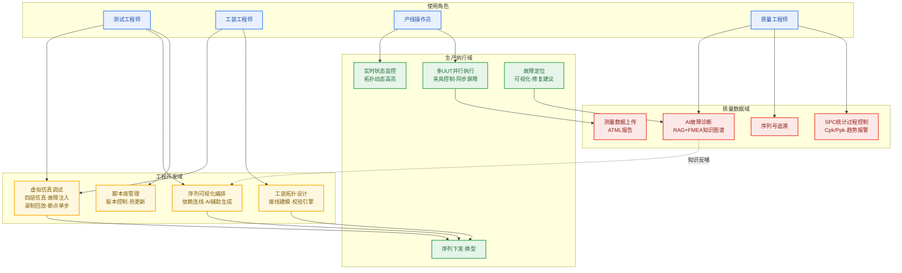

### 3.2 核心业务闭环

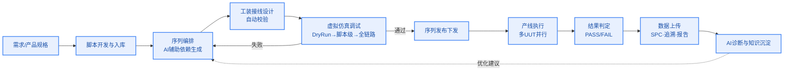

业务要点：
1. **设计调试前移**：序列在虚拟环境完成验证后才允许下发产线，目标"零硬件依赖调试，缩短开发周期 60%+"（来源：虚拟仿真补充方案设计目标）。
2. **拓扑驱动执行**：工装拓扑不仅用于展示，还参与调度前的路由校验与资源分配（见 6.7.5）。
3. **知识反哺**：产线故障经 AI 诊断沉淀入 FMEA 知识图谱，反哺序列与脚本优化。

---

## 4. 技术架构

### 4.1 总体技术架构（分层视图）

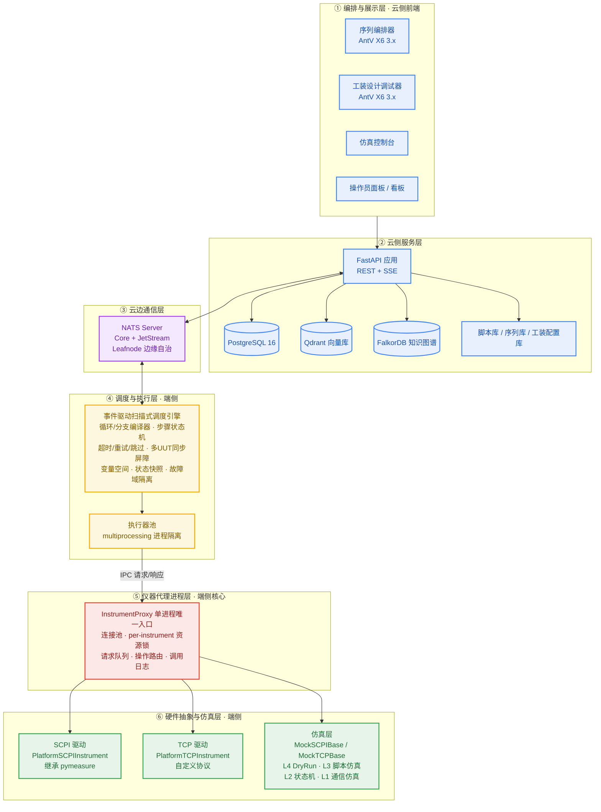

### 4.2 关键架构决策（评审问题闭环）

| 决策 | 背景问题 | 方案 | 影响 |
|------|----------|------|------|
| AD-1 仪器代理进程 | A2：多进程下 threading.Lock 无法跨进程互斥 | 所有仪器操作（真实/Mock、SCPI/TCP/串口）统一经 InstrumentProxy 单进程；执行进程通过 IPC 请求 | 从根本上解决资源互斥与连接管理；附带获得统一调用录制与故障注入点 |
| AD-2 驱动双基类分离 | A3：TCP 自定义协议设备强行继承 pymeasure.Instrument 造成接口扭曲 | SCPI 设备继承 pymeasure（PlatformSCPIInstrument）；TCP 设备独立基类（PlatformTCPInstrument）；Mock 层对应双基类对齐 | 驱动职责清晰，互不干扰 |
| AD-3 仿真主路径统一 | A1：pyvisa-sim 与 MockInstrumentBase 双路径职责冲突 | MockInstrumentBase 为唯一平台仿真入口；pyvisa-sim 降级为可选协议级联调工具（tools/protocol_debugger.py，不进主流程） | 仿真行为单一可信来源 |
| AD-4 事件驱动扫描式调度 | 静态流程图无法表达动态依赖与自动并发 | 事件总线 + 依赖索引增量评估，1 秒兜底全量扫描 | 毫秒级响应，防事件丢失 |
| AD-5 声明式控制流 | 控制节点硬编码导致调度器复杂 | 循环/分支/屏障均为 DSL 声明，编译期展开为扁平 DAG | 调度器保持纯粹，便于仿真与 AI 生成 |

### 4.3 代码模块结构

```
ATEStudio/
├── src/
│   ├── ate_cloud/                # 云侧服务（FastAPI，端口 8000）
│   │   ├── api/v1/               # REST 路由（23 个路由文件，99 个端点）
│   │   ├── auth/                 # JWT 认证 + RBAC
│   │   ├── db/                   # SQLAlchemy 异步引擎与会话
│   │   ├── models/               # ORM 模型
│   │   ├── nats/                 # NATS 消息与 SSE 桥接（sse_bridge.py）
│   │   ├── observability/        # OpenTelemetry 日志与追踪
│   │   ├── schemas/              # Pydantic 请求/响应模型
│   │   ├── services/             # 业务逻辑（26 个服务模块）
│   │   └── storage/              # 文件存储抽象
│   ├── ate_platform/             # 端侧执行引擎
│   │   ├── scheduler/            # 事件驱动扫描式调度器、JetStream worker
│   │   ├── proxy/                # 仪器代理进程（V3.2 新增）
│   │   ├── executor/             # 脚本执行、ContextProxy
│   │   ├── drivers/              # 双基类驱动、pymeasure 适配、Mock、gRPC
│   │   ├── simulation/           # 四层仿真、故障注入、DryRun
│   │   ├── fixture/              # 夹具控制器（V3.2 新增）
│   │   ├── runtime/              # 拓扑状态发布、故障定位器
│   │   ├── recorder/             # 录制/回放
│   │   ├── debug/                # 断点管理、调试执行器
│   │   ├── comm/                 # NATS 客户端
│   │   ├── dsl/                  # YAML DSL 解析
│   │   └── openhtf/              # OpenHTF 适配器（可选）
│   ├── shared/                   # 共享类型（dsl.py、events.py、measurement.py）
│   └── frontend/                 # Vue 3 + TypeScript 前端
│       └── src/
│           ├── views/            # SequenceEditor、FixtureDesigner、Dashboard…
│           ├── api/              # API 客户端模块
│           ├── composables/      # useGraph、useSerializer、useSimulation…
│           ├── stores/           # Pinia stores
│           └── router/           # 路由配置
├── tests/                        # 后端测试（unit / integration / e2e）
├── alembic/                      # 数据库迁移（12 个版本）
├── examples/                     # 示例测试脚本与运行器
├── config/                       # 配置文件（NATS leafnode 等）
├── profiles/                     # 仿真场景配置
├── docker-compose.yml            # dev / cloud 两个 profile
└── .github/workflows/            # CI/CD（lint + test + frontend + security）
```

### 4.4 技术选型

#### 4.4.1 端侧

| 模块 | 组件 | 版本 | License |
|------|------|------|---------|
| 操作系统 | Ubuntu 24.04 LTS / Deepin UOS | — | — |
| 容器运行时 | Docker / Podman | 最新稳定版 | Apache 2.0 |
| 语言运行时 | Python | 3.12+ | PSF |
| 硬件测试框架 | OpenHTF（可选插件） | v1.5.2+ | Apache 2.0 |
| 仪器通信 | PyVISA-py + pymeasure | pymeasure 0.16.0 | MIT |
| 协议联调（可选） | pyvisa-sim | 0.7.1（仅独立工具，不进主仿真路径） | MIT |
| 序列调度 | 自研事件驱动扫描式调度器 | asyncio + multiprocessing + 事件总线 | 自研开源 |
| 表达式求值 | simpleeval + 内置函数库 | 最新稳定版 | MIT |
| 云边通信 | nats-py | 最新稳定版 | Apache 2.0 |
| 本地缓存 | SQLite（WAL 模式） | 3.x | Public Domain |

#### 4.4.2 云侧

| 模块 | 组件 | 版本 | License |
|------|------|------|---------|
| Web 框架 | FastAPI | 0.110+ | MIT |
| ORM | SQLAlchemy（异步） | 2.0+ | MIT |
| 数据校验 | Pydantic | 2.x | MIT |
| 数据库迁移 | Alembic | 1.13+ | MIT |
| 关系数据库 | PostgreSQL（生产）/ SQLite（默认开发） | 16.x+ | PostgreSQL License |
| 向量数据库 | Qdrant | v1.18.0+ | Apache 2.0 |
| 图数据库 | FalkorDB（Redis 8 + falkordb.so，RESP/6379） | 4.x | SSPL v1 |
| 消息中间件 | NATS Server（含 JetStream） | v2.12.0+ | Apache 2.0 |
| AI 框架 | DeepAgents | 最新稳定版 | MIT |
| 大语言模型 | DeepSeek / Qwen（开源） | — | 开源 |
| Embedding | BAAI/bge-m3 等 | — | MIT |
| 脚本存储 | 本地文件系统 / NFS（元数据入库） | — | — |
| 包管理 / 质量 | uv、ruff、mypy、pytest | — | MIT/Apache |

#### 4.4.3 前端

| 模块 | 组件 | 版本 | License |
|------|------|------|---------|
| 框架 | Vue | 3.5 | MIT |
| 语言 | TypeScript | 6.0 | Apache-2.0 |
| 构建 | Vite | 8.x | MIT |
| 图编辑引擎 | @antv/x6（3.x 起插件合并入主包，无需单装插件） | 3.1 | MIT |
| Vue 节点适配 | @antv/x6-vue-shape | 3.x | MIT |
| 状态管理 | Pinia | 4.0 | MIT |
| UI 组件库 | Element Plus | 2.14 | MIT |
| 代码编辑器 | Monaco Editor | 0.56 | MIT |
| CSS | Tailwind CSS | 4.x | MIT |
| 测试 | Vitest | 4.x | MIT |
| 布局算法 | Dagre / ELK（工装拓扑自动分层布局） | — | MIT |

#### 4.4.4 Qdrant 选型理由（评审确认）

| 对比维度 | Qdrant | PGVector |
|----------|--------|----------|
| p95 延迟 | **36.73ms** | 60.42ms（Qdrant 优 39%） |
| QPS（10 并发） | **1,245** | 318（Qdrant 优 291%） |
| 独立扩展性 | 可独立水平扩展 | 受限于 PostgreSQL |
| 实现 | Rust，内存安全、高性能 | — |

> 数据来源：方案选型阶段基准测试记录（V3.0 方案第 3.4 节）。

---

## 5. 云边通信设计（NATS）

### 5.1 通信总览

统一采用 NATS，按可靠性要求分流：

| 方向 | 内容 | NATS 特性 |
|------|------|-----------|
| 云→端 | 序列下发、执行控制指令 | Core NATS |
| 端→云 | 进度、测量数据、日志 | JetStream（持久化，保证不丢） |
| 端→云 | 心跳、状态 | Core NATS |
| 双向 | 请求-响应（状态查询、快照获取） | NATS Request/Reply |

边缘自治：端侧通过 NATS Leafnode 连接云侧（config/nats-leafnode.conf），断网时端侧本地缓存事件，恢复后补传（已实现）。

### 5.2 主题设计

```
teststation/{station_id}/
├── cmd/                          # 云侧→端侧命令
│   ├── start_execution           # 启动测试执行
│   ├── stop_execution            # 停止执行
│   ├── pause_execution           # 暂停
│   ├── resume_execution          # 恢复
│   ├── update_plan               # 更新测试序列
│   ├── update_topology           # 更新工装拓扑
│   └── inject_fault              # 注入故障（仿真模式）
├── event/                        # 端侧→云侧事件
│   ├── execution_started / execution_completed
│   ├── step_started / step_completed / step_failed
│   ├── instrument_status         # 仪器状态变化
│   ├── fixture_status            # 夹具状态变化
│   ├── topology_state            # 拓扑运行时状态（SSE 数据源）
│   └── fault_detected            # 故障检测
├── telemetry/                    # 遥测数据
│   ├── measurements              # 测量值流
│   ├── instrument_calls          # 仪器调用记录
│   └── system_metrics            # CPU/内存/连接数
└── req/                          # 请求-响应
    ├── get_status                # 查询当前状态
    ├── get_snapshot              # 获取执行快照
    └── list_instruments          # 列出仪器
```

### 5.3 NATS 客户端

```python
# src/ate_platform/comm/nats_client.py
import asyncio
import nats
import json

class NATSClient:
    def __init__(self, station_id: str, nats_url: str = "nats://localhost:4222"):
        self.station_id = station_id
        self.nats_url = nats_url
        self.nc = None

    async def connect(self):
        self.nc = await nats.connect(self.nats_url)

    def _topic(self, category: str, action: str) -> str:
        return f"teststation/{self.station_id}/{category}/{action}"

    # 云侧→端侧：发送命令
    async def send_command(self, action: str, payload: dict):
        await self.nc.publish(self._topic("cmd", action), json.dumps(payload).encode())

    # 端侧→云侧：发布事件
    async def publish_event(self, action: str, payload: dict):
        await self.nc.publish(self._topic("event", action), json.dumps(payload).encode())

    # 订阅
    async def subscribe(self, category: str, action: str, handler):
        sub = await self.nc.subscribe(self._topic(category, action))
        async for msg in sub.messages:
            await handler(json.loads(msg.data.decode()))

    # 请求-响应
    async def request(self, category: str, action: str, payload: dict, timeout: float = 5.0):
        resp = await self.nc.request(
            self._topic(category, action),
            json.dumps(payload).encode(),
            timeout=timeout
        )
        return json.loads(resp.data.decode())
```

### 5.4 拓扑状态实时推送链路

端侧调度器在状态变化时发布 `event/topology_state`，云侧 FastAPI 订阅后经 SSE 推送至工装调试器：

```python
# 端侧：拓扑状态变化时发布
async def _publish_topology_state(self, event_type: str, data: dict):
    await self.nats.publish_event("topology_state", {
        "type": event_type,  # instrument | fixture | dut | link | fault
        "execution_id": self.execution_id,
        "timestamp": time.time(),
        **data,
    })

# 云侧：NATS 订阅 → SSE 广播
@app.get("/api/v1/executions/{exec_id}/topology-stream")
async def topology_stream(exec_id: str):
    async def event_generator():
        queue = asyncio.Queue()
        async def handler(msg):
            if msg.get("execution_id") == exec_id:
                await queue.put(msg)
        await nats_client.subscribe("event", "topology_state", handler)
        while True:
            msg = await queue.get()
            yield f"event: {msg['type']}\ndata: {json.dumps(msg)}\n\n"
    return StreamingResponse(event_generator(), media_type="text/event-stream")
```

前端事件类型定义（与后端事件一一对应）：

```typescript
type TopologyEvent =
  | { type: 'instrument'; id: string; status: InstrumentStatus; channel?: string }
  | { type: 'fixture'; id: string; status: FixtureStatus; actuators?: ActuatorState[] }
  | { type: 'dut'; id: string; status: DUTStatus; testPoints?: TestPointResult[] }
  | { type: 'link'; id: string; active: boolean; signalType: string }
  | { type: 'sensor'; fixtureId: string; sensorId: string; value: number }
  | { type: 'fault'; location: FaultLocation; message: string; severity: 'error' | 'warning' };
```

---

## 6. 端侧详细设计

### 6.1 仪器代理进程（InstrumentProxy）— 架构核心

#### 6.1.1 设计目标

| 目标 | 说明 |
|------|------|
| **统一入口** | 所有仪器操作（真实/Mock、SCPI/TCP/串口）经过代理进程 |
| **资源互斥** | per-instrument 锁，保证同一仪器不被两个执行进程同时操作 |
| **连接复用** | 连接池管理，避免频繁建立/断开连接 |
| **调用录制** | 所有调用自动记录（JSONL），为录制/回放提供数据源 |
| **故障注入点** | 网络/协议级故障在代理层统一拦截注入 |

#### 6.1.2 进程交互时序

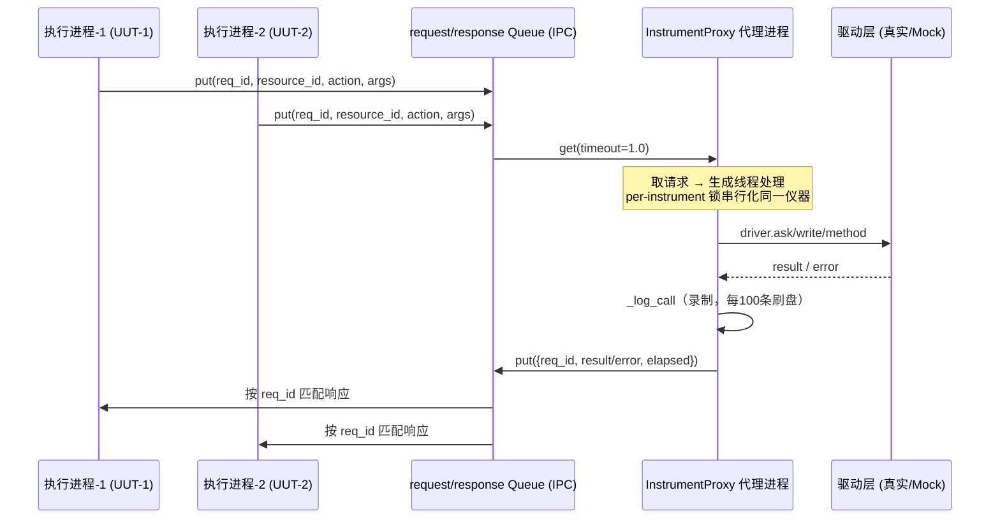

#### 6.1.3 核心实现

```python
# src/ate_platform/proxy/instrument_proxy.py
import multiprocessing
from multiprocessing import Process, Queue, Lock
import threading
import time
import json
from pathlib import Path

class InstrumentProxy(Process):
    """仪器代理进程：所有仪器操作的唯一入口"""

    def __init__(self, request_queue: Queue, response_queue: Queue,
                 config: dict, simulation: bool = False):
        super().__init__(name="InstrumentProxy", daemon=True)
        self.request_queue = request_queue
        self.response_queue = response_queue
        self.config = config
        self.simulation = simulation
        self._instruments = {}       # resource_id -> driver instance
        self._locks = {}             # resource_id -> threading.Lock
        self._call_log = []          # 调用录制
        self._running = False

    def run(self):
        self._running = True
        self._init_instruments()
        while self._running:
            try:
                request = self.request_queue.get(timeout=1.0)
                if request is None:  # 停止信号
                    break
                threading.Thread(target=self._handle_request, args=(request,)).start()
            except multiprocessing.queues.Empty:
                continue
            except Exception as e:
                self._response(request.get("req_id"), {"error": str(e)})

    def _init_instruments(self):
        """根据配置初始化所有仪器驱动（真实或Mock）"""
        for res_id, inst_config in self.config.get("instruments", {}).items():
            self._locks[res_id] = threading.Lock()
            if self.simulation:
                driver = MockDriverFactory.get(res_id, inst_config.get("type"),
                                               inst_config.get("profile"))
            else:
                driver = DriverRegistry.get_instrument(res_id, simulation=False)
            self._instruments[res_id] = driver

    def _handle_request(self, request: dict):
        """处理单个仪器操作请求"""
        req_id = request["req_id"]
        resource_id = request["resource_id"]
        action = request["action"]  # "write" | "ask" | "method" | "connect" | "disconnect"
        args = request.get("args", [])
        kwargs = request.get("kwargs", {})

        lock = self._locks.get(resource_id)
        if lock is None:
            self._response(req_id, {"error": f"Unknown instrument: {resource_id}"})
            return

        with lock:  # per-instrument 互斥
            try:
                driver = self._instruments[resource_id]
                start_time = time.time()

                if action == "write":
                    driver.write(*args, **kwargs)
                    result = None
                elif action == "ask":
                    result = driver.ask(*args, **kwargs)
                elif action == "method":
                    method_name = kwargs.pop("method_name")
                    method = getattr(driver, method_name)
                    result = method(*args, **kwargs)
                elif action == "connect":
                    result = driver.open() if hasattr(driver, 'open') else True
                elif action == "disconnect":
                    result = driver.close() if hasattr(driver, 'close') else True
                else:
                    raise ValueError(f"Unknown action: {action}")

                elapsed = time.time() - start_time
                self._log_call(resource_id, action, args, kwargs, result, elapsed)
                self._response(req_id, {"result": result, "elapsed": elapsed})

            except Exception as e:
                self._log_call(resource_id, action, args, kwargs, None, 0, error=str(e))
                self._response(req_id, {"error": str(e), "error_type": type(e).__name__})

    def _response(self, req_id: str, data: dict):
        self.response_queue.put({"req_id": req_id, **data})

    def _log_call(self, resource_id, action, args, kwargs, result, elapsed, error=None):
        entry = {
            "timestamp": time.time(),
            "resource_id": resource_id,
            "action": action,
            "args": args,
            "kwargs": {k: v for k, v in kwargs.items() if k != "method_name"},
            "result": str(result)[:500] if result else None,
            "elapsed_ms": round(elapsed * 1000, 2),
            "error": error,
        }
        self._call_log.append(entry)
        # 每100条刷盘一次
        if len(self._call_log) >= 100:
            self._flush_log()

    def _flush_log(self):
        log_dir = Path("/var/log/test_platform/recordings")
        log_dir.mkdir(parents=True, exist_ok=True)
        log_file = log_dir / f"recording_{int(time.time())}.jsonl"
        with open(log_file, 'a') as f:
            for entry in self._call_log:
                f.write(json.dumps(entry) + "\n")
        self._call_log.clear()
```

#### 6.1.4 执行进程侧客户端

```python
# src/ate_platform/proxy/instrument_client.py
"""执行进程中的仪器客户端，通过IPC请求代理进程"""
import multiprocessing
import uuid
import time

class InstrumentClient:
    """执行进程使用的仪器客户端，所有操作通过IPC转发到代理进程"""

    def __init__(self, request_queue: multiprocessing.Queue,
                 response_queue: multiprocessing.Queue,
                 resource_id: str, timeout: float = 30.0):
        self.request_queue = request_queue
        self.response_queue = response_queue
        self.resource_id = resource_id
        self.timeout = timeout

    def _call(self, action: str, *args, **kwargs) -> any:
        req_id = str(uuid.uuid4())
        self.request_queue.put({
            "req_id": req_id,
            "resource_id": self.resource_id,
            "action": action,
            "args": args,
            "kwargs": kwargs,
        })
        # 等待响应（简化实现；生产建议改为事件回调/Connection 管道）
        deadline = time.time() + self.timeout
        while time.time() < deadline:
            try:
                resp = self.response_queue.get(timeout=0.5)
                if resp["req_id"] == req_id:
                    if "error" in resp:
                        raise RuntimeError(f"Instrument error: {resp['error']}")
                    return resp.get("result")
                else:
                    self.response_queue.put(resp)
            except multiprocessing.queues.Empty:
                continue
        raise TimeoutError(f"Instrument call timeout: {action}")

    def write(self, command: str):
        return self._call("write", command)

    def ask(self, command: str) -> str:
        return self._call("ask", command)

    def call_method(self, method_name: str, *args, **kwargs):
        return self._call("method", method_name=method_name, *args, **kwargs)

    def __getattr__(self, name):
        """透明转发方法调用（如 measure_voltage() → call_method("measure_voltage")）"""
        if name.startswith("_"):
            raise AttributeError(name)
        def method(*args, **kwargs):
            return self.call_method(name, *args, **kwargs)
        return method
```

#### 6.1.5 连接池

```python
# src/ate_platform/proxy/connection_pool.py
class ConnectionPool:
    """仪器连接池，在代理进程内管理"""

    def __init__(self, max_idle_time: float = 300.0):
        self._connections = {}   # resource_id -> (connection, last_used)
        self._max_idle = max_idle_time

    def get(self, resource_id: str, create_func):
        """获取连接，不存在或已过期则创建"""
        now = time.time()
        if resource_id in self._connections:
            conn, last_used = self._connections[resource_id]
            if now - last_used < self._max_idle:
                self._connections[resource_id] = (conn, now)
                return conn
            else:
                self._close(resource_id)
        conn = create_func()
        self._connections[resource_id] = (conn, now)
        return conn

    def release(self, resource_id: str):
        """标记连接为空闲（不关闭，保留复用）"""
        if resource_id in self._connections:
            conn, _ = self._connections[resource_id]
            self._connections[resource_id] = (conn, time.time())

    def cleanup_expired(self):
        """清理过期连接"""
        now = time.time()
        expired = [rid for rid, (_, last) in self._connections.items()
                   if now - last > self._max_idle]
        for rid in expired:
            self._close(rid)
```

#### 6.1.6 代理层故障注入拦截点

```python
def _handle_request(self, request):
    # ... 锁获取 ...
    with lock:
        # 故障注入在代理层统一执行（真实/仿真均适用）
        fault = self._fault_injector.check(request)
        if fault:
            self._response(req_id, {"error": fault["error"]})
            return
        # 正常调用驱动
        ...
```

### 6.2 仪器驱动层（双基类）

#### 6.2.1 目录结构

```
src/ate_platform/drivers/
├── base/
│   ├── scpi_instrument.py       # 继承 pymeasure.Instrument（SCPI设备）
│   ├── tcp_instrument.py        # 独立基类（自定义TCP协议设备）
│   ├── mock_scpi_base.py        # SCPI设备Mock基类
│   └── mock_tcp_base.py         # TCP设备Mock基类
├── pymeasure_wrappers/          # pymeasure预建驱动适配层
│   ├── adapter.py               # 适配pymeasure驱动到平台统一接口
│   └── register.py
├── scpi/                        # SCPI设备自研驱动
│   ├── chroma_psu.py
│   └── domestic_dmm.py
├── tcp/                         # TCP设备自研驱动
│   ├── chroma_eload.py          # Chroma电子负载（TCP自定义协议）
│   └── custom_device.py
├── mock/                        # Mock驱动
│   ├── mock_dmm.py
│   ├── mock_psu.py
│   ├── mock_eload.py
│   └── mock_factory.py
└── registry.py
```

#### 6.2.2 SCPI 基类（继承 pymeasure）

```python
# src/ate_platform/drivers/base/scpi_instrument.py
from pymeasure.instruments import Instrument

class PlatformSCPIInstrument(Instrument):
    """SCPI协议设备基类，继承 pymeasure.Instrument"""

    def __init__(self, resource_id: str, adapter=None, **kwargs):
        self.resource_id = resource_id
        self._simulation_mode = kwargs.pop('simulation', False)
        if adapter is None and not self._simulation_mode:
            adapter = resource_id
        super().__init__(adapter, **kwargs)

    @property
    def simulation_mode(self):
        return self._simulation_mode

    def identify(self) -> str:
        return self.id

    def reset(self):
        self.write("*RST")

    def self_test(self) -> bool:
        return self.ask("*TST?").strip() == "0"
```

#### 6.2.3 pymeasure 预建驱动适配层

```python
# src/ate_platform/drivers/pymeasure_wrappers/adapter.py
class PyMeasureAdapter:
    """将pymeasure预建驱动适配到平台统一接口"""

    @staticmethod
    def wrap(pymeasure_class):
        """动态包装pymeasure驱动类，增加平台扩展"""
        class WrappedDriver(PlatformSCPIInstrument, pymeasure_class):
            """多重继承：PlatformSCPIInstrument提供平台接口，pymeasure_class提供驱动实现"""
            def __init__(self, resource_id, **kwargs):
                PlatformSCPIInstrument.__init__(self, resource_id, **kwargs)

        WrappedDriver.__name__ = f"Platform_{pymeasure_class.__name__}"
        return WrappedDriver
```

```python
# src/ate_platform/drivers/pymeasure_wrappers/register.py
from pymeasure.instruments.keysight import Keysight34465A, KeysightE36312A
from pymeasure.instruments.rigol import RigolDP800
from .adapter import PyMeasureAdapter
from ..registry import DriverRegistry

def register_pymeasure_drivers():
    DriverRegistry.register("keysight_34465a",
                            PyMeasureAdapter.wrap(Keysight34465A),
                            category="dmm", protocol="scpi")
    DriverRegistry.register("keysight_e36312a",
                            PyMeasureAdapter.wrap(KeysightE36312A),
                            category="psu", protocol="scpi")
    DriverRegistry.register("rigol_dp800",
                            PyMeasureAdapter.wrap(RigolDP800),
                            category="psu", protocol="scpi")
```

> 风险与降级：多重继承若出现 MRO 冲突，改用组合模式（内部持有 pymeasure 实例）。P0 阶段先以 Keysight 34465A 做 Spike 验证。

#### 6.2.4 TCP 基类（独立，不依赖 pymeasure/PyVISA）

```python
# src/ate_platform/drivers/base/tcp_instrument.py
import socket
import struct

class PlatformTCPInstrument:
    """自定义TCP协议设备基类，不依赖pymeasure/PyVISA"""

    def __init__(self, resource_id: str, host: str = None, port: int = None,
                 timeout: float = 5.0, **kwargs):
        self.resource_id = resource_id
        self._simulation_mode = kwargs.pop('simulation', False)
        if host is None:
            # 从 resource_id 解析: "TCP::192.168.1.100::5025"
            parts = resource_id.split("::")
            if len(parts) >= 3:
                host, port = parts[1], int(parts[2])
        self.host = host
        self.port = port
        self.timeout = timeout
        self._socket = None

    def connect(self):
        if self._simulation_mode:
            return  # 仿真模式不实际连接
        self._socket = socket.socket(socket.AF_INET, socket.SOCK_STREAM)
        self._socket.settimeout(self.timeout)
        self._socket.connect((self.host, self.port))

    def disconnect(self):
        if self._socket:
            self._socket.close()
            self._socket = None

    def send(self, data: bytes):
        if self._simulation_mode:
            return
        self._socket.sendall(data)

    def recv(self, size: int = 4096) -> bytes:
        if self._simulation_mode:
            return b""
        return self._socket.recv(size)

    def send_and_recv(self, data: bytes, expected_len: int = None) -> bytes:
        self.send(data)
        if expected_len:
            return self._recv_exact(expected_len)
        return self.recv()

    def _recv_exact(self, size: int) -> bytes:
        data = b""
        while len(data) < size:
            chunk = self.recv(size - len(data))
            if not chunk:
                raise ConnectionError("Connection closed")
            data += chunk
        return data

    @property
    def simulation_mode(self):
        return self._simulation_mode

    def identify(self) -> str:
        raise NotImplementedError

    def reset(self):
        raise NotImplementedError
```

#### 6.2.5 TCP 驱动示例（Chroma 63004 电子负载）

帧格式约定：`[HEAD(2)][ADDR(1)][CMD(1)][LEN(2)][DATA][CHECKSUM(1)]`

```python
# src/ate_platform/drivers/tcp/chroma_eload.py
from ..base.tcp_instrument import PlatformTCPInstrument
import struct

class Chroma63004(PlatformTCPInstrument):
    """Chroma 63004 电子负载（TCP自定义协议）"""

    HEAD = b'\xAA\x55'

    def __init__(self, resource_id, **kwargs):
        super().__init__(resource_id, **kwargs)
        self._addr = kwargs.get('addr', 0x01)

    def _build_frame(self, cmd: int, data: bytes = b'') -> bytes:
        length = len(data)
        frame = self.HEAD + struct.pack('>BBH', self._addr, cmd, length) + data
        checksum = sum(frame) & 0xFF
        return frame + struct.pack('>B', checksum)

    def _parse_frame(self, raw: bytes) -> tuple:
        if raw[:2] != self.HEAD:
            raise ValueError("Invalid frame header")
        addr, cmd, length = struct.unpack('>BBH', raw[2:6])
        data = raw[6:6+length]
        return cmd, data

    def set_mode(self, channel: int, mode: str):
        """设置工作模式: CC/CV/CR/CP"""
        mode_map = {"CC": 0, "CV": 1, "CR": 2, "CP": 3}
        cmd = 0x20
        data = struct.pack('>BB', channel, mode_map[mode])
        self.send_and_recv(self._build_frame(cmd, data))

    def set_current(self, channel: int, current: float):
        cmd = 0x21
        data = struct.pack('>Bf', channel, current)
        self.send_and_recv(self._build_frame(cmd, data))

    def measure_voltage(self, channel: int) -> float:
        cmd = 0x40
        data = struct.pack('>B', channel)
        resp = self.send_and_recv(self._build_frame(cmd, data), expected_len=10)
        _, resp_data = self._parse_frame(resp)
        return struct.unpack('>f', resp_data[:4])[0]

    def measure_current(self, channel: int) -> float:
        cmd = 0x41
        data = struct.pack('>B', channel)
        resp = self.send_and_recv(self._build_frame(cmd, data), expected_len=10)
        _, resp_data = self._parse_frame(resp)
        return struct.unpack('>f', resp_data[:4])[0]

    def input_on(self, channel: int):
        cmd = 0x30
        data = struct.pack('>BB', channel, 1)
        self.send_and_recv(self._build_frame(cmd, data))

    def input_off(self, channel: int):
        cmd = 0x30
        data = struct.pack('>BB', channel, 0)
        self.send_and_recv(self._build_frame(cmd, data))
```

#### 6.2.6 Mock 双基类

Mock 驱动与真实驱动接口完全对齐，并内置网络故障注入能力：

```python
# src/ate_platform/drivers/base/mock_scpi_base.py
from .scpi_instrument import PlatformSCPIInstrument
import random, time

class MockSCPIBase(PlatformSCPIInstrument):
    """SCPI设备Mock基类"""
    def __init__(self, resource_id, profile=None, **kwargs):
        kwargs['simulation'] = True
        super().__init__(resource_id, adapter=None, **kwargs)
        self._profile = profile or {}
        self._call_count = 0
        self._fault_rules = []
        self._network_fault = {"enabled": False, "latency_ms": 0,
                               "jitter_ms": 0, "packet_loss_rate": 0.0, "disconnect": False}

    def write(self, command):
        self._call_count += 1
        self._apply_network_fault()
        self._check_fault('write', command)

    def ask(self, command):
        self._call_count += 1
        self._apply_network_fault()
        self._check_fault('ask', command)
        return self._generate_response(command)

    def values(self, command, **kwargs):
        return [float(x) for x in self.ask(command).split(',')]

    def _generate_response(self, command):
        raise NotImplementedError

    def _apply_network_fault(self):
        nf = self._network_fault
        if not nf["enabled"]:
            return
        if nf["disconnect"]:
            raise ConnectionError("Simulated disconnect")
        if nf["latency_ms"] > 0:
            jitter = random.uniform(-nf["jitter_ms"], nf["jitter_ms"])
            time.sleep(max(0, (nf["latency_ms"] + jitter) / 1000))
        if nf["packet_loss_rate"] > 0 and random.random() < nf["packet_loss_rate"]:
            raise TimeoutError("Simulated packet loss")

    def set_network_fault(self, **kwargs):
        self._network_fault.update(kwargs)

    def _check_fault(self, method, command):
        for rule in self._fault_rules:
            if rule.matches(self.resource_id, method, command, self._call_count):
                raise rule.create_exception()

    def add_fault_rule(self, rule):
        self._fault_rules.append(rule)
```

```python
# src/ate_platform/drivers/base/mock_tcp_base.py
from .tcp_instrument import PlatformTCPInstrument
import random, time

class MockTCPBase(PlatformTCPInstrument):
    """TCP设备Mock基类，与MockSCPIBase接口对齐"""
    def __init__(self, resource_id, profile=None, **kwargs):
        kwargs['simulation'] = True
        super().__init__(resource_id, **kwargs)
        self._profile = profile or {}
        self._call_count = 0
        self._fault_rules = []
        self._network_fault = {"enabled": False, "latency_ms": 0,
                               "jitter_ms": 0, "packet_loss_rate": 0.0, "disconnect": False}
        self._state = {}

    def send(self, data):
        self._call_count += 1
        self._apply_network_fault()

    def recv(self, size=4096):
        return self._generate_response(None)

    def send_and_recv(self, data, expected_len=None):
        self._call_count += 1
        self._apply_network_fault()
        return self._generate_response(data)

    def _generate_response(self, request_data):
        raise NotImplementedError

    # _apply_network_fault / set_network_fault / add_fault_rule 与 MockSCPIBase 对齐（略）
```

#### 6.2.7 MockDriverFactory

```python
# src/ate_platform/drivers/mock/mock_factory.py
class MockDriverFactory:
    _registry = {}

    @classmethod
    def register(cls, instrument_type, mock_class, protocol="scpi"):
        cls._registry[instrument_type] = (mock_class, protocol)

    @classmethod
    def get(cls, resource_id, instrument_type=None, profile=None):
        if instrument_type is None:
            instrument_type = cls._infer_type(resource_id)
        entry = cls._registry.get(instrument_type)
        if entry:
            mock_class, _ = entry
            return mock_class(resource_id, profile)
        # 兜底：根据协议类型返回通用Mock
        if resource_id.startswith("TCP::"):
            return GenericMockTCP(resource_id, profile)
        return GenericMockSCPI(resource_id, profile)

    @staticmethod
    def _infer_type(resource_id):
        if "DMM" in resource_id.upper(): return "dmm"
        if "PSU" in resource_id.upper() or "POWER" in resource_id.upper(): return "psu"
        if "LOAD" in resource_id.upper() or "ELoad" in resource_id: return "eload"
        return "generic"

MockDriverFactory.register("dmm", MockDMM, "scpi")
MockDriverFactory.register("psu", MockPSU, "scpi")
MockDriverFactory.register("eload", MockELoad, "tcp")
```

### 6.3 事件驱动扫描式调度引擎

#### 6.3.1 调度原理

1. **事件驱动**：步骤完成、变量变更、资源释放等事件触发受影响步骤的条件评估，满足即提交执行。
2. **定时兜底**：低频全量扫描（1 秒），防止事件丢失或外部状态依赖。
3. **依赖索引**：注册时建立 `step_dependents`、`variable_dependents`、`resource_waiters` 三张索引，事件发生时直接定位受影响集合，避免全量扫描。

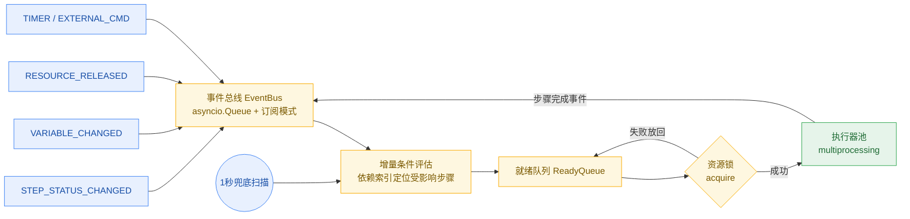

#### 6.3.2 事件总线

```python
import asyncio
from enum import Enum
from collections import defaultdict

class EventType(Enum):
    STEP_STATUS_CHANGED = "step_status"
    VARIABLE_CHANGED = "variable"
    RESOURCE_RELEASED = "resource_released"
    TIMER_EXPIRED = "timer"
    EXTERNAL_CMD = "external"

class EventBus:
    def __init__(self):
        self._subscribers = defaultdict(set)
        self._queue = asyncio.Queue()

    def subscribe(self, event_type: EventType, callback):
        self._subscribers[event_type].add(callback)

    async def publish(self, event_type: EventType, data: dict):
        await self._queue.put((event_type, data))

    async def start(self):
        while True:
            event_type, data = await self._queue.get()
            for cb in self._subscribers.get(event_type, []):
                asyncio.create_task(cb(data))
            # 通用事件（None）用于全局兜底评估
            for cb in self._subscribers.get(None, []):
                asyncio.create_task(cb(data))
```

#### 6.3.3 调度器核心结构

```python
# src/ate_platform/scheduler/scanner_scheduler.py
class ScannerScheduler:
    def __init__(self, plan: dict, proxy_client, simulation: bool = False):
        self.plan = plan
        self.proxy_client = proxy_client  # 仪器代理进程客户端
        self.simulation = simulation
        self.registry = StepRegistry()    # 步骤注册表+依赖索引
        self.variable_space = VariableSpace()
        self.completed = set()
        self.running = set()
        self.failed = set()
        self.uut_manager = UUTManager(plan.get("uut_count", 1))
        self.snapshot = StateSnapshot(plan.get("execution_id", "default"))
        self._compiler = SequenceCompiler(plan)  # 循环/分支编译器

    async def run(self):
        # 编译YAML为可执行DAG
        steps = self._compiler.compile()
        self.registry.load(steps)

        # 崩溃恢复检查
        if self.snapshot.can_resume():
            await self._restore(self.snapshot.load())

        # 主循环：扫描就绪步骤
        while not self._all_done():
            ready = self._scan_ready()
            for step in ready:
                if step not in self.running:
                    await self._execute_step(step)
            await asyncio.sleep(0.01)
```

#### 6.3.4 循环/分支编译器

将 DSL 中的 loop / branch / subsequence 在编译期展开为扁平 DAG：

```python
# src/ate_platform/scheduler/compiler.py
class SequenceCompiler:
    """将YAML DSL编译为扁平的步骤DAG（展开循环、解析分支）"""

    def __init__(self, plan: dict):
        self.plan = plan
        self._step_counter = 0

    def compile(self) -> list:
        """编译入口：返回扁平步骤列表，每个步骤有唯一ID和依赖"""
        raw_steps = self.plan.get("steps", [])
        compiled = []
        for step in raw_steps:
            compiled.extend(self._compile_step(step, parent_deps=[]))
        return compiled

    def _compile_step(self, step: dict, parent_deps: list) -> list:
        """编译单个步骤（可能是循环/分支/子序列，递归展开）"""
        step_type = step.get("type", "action")
        if step_type == "loop":
            return self._compile_loop(step, parent_deps)
        elif step_type == "branch":
            return self._compile_branch(step, parent_deps)
        elif step_type == "subsequence":
            return self._compile_subsequence(step, parent_deps)
        else:
            return [self._make_action_step(step, parent_deps)]

    def _compile_loop(self, loop: dict, parent_deps: list) -> list:
        """编译循环：展开为N个迭代，迭代间串行依赖"""
        count = loop.get("count", 1)
        iterator_var = loop.get("iterator", "i")
        body = loop.get("steps", [])
        result = []
        prev_iter_deps = list(parent_deps)

        for i in range(count):
            iter_deps = list(prev_iter_deps)
            for body_step in body:
                body_step_copy = dict(body_step)
                body_step_copy["loop_context"] = {iterator_var: i}
                compiled = self._compile_step(body_step_copy, iter_deps)
                result.extend(compiled)
                iter_deps = [s["id"] for s in compiled]
            prev_iter_deps = iter_deps  # 下一迭代依赖本迭代最后步骤
        return result

    def _compile_branch(self, branch: dict, parent_deps: list) -> list:
        """编译分支：编译为条件步骤，运行时根据变量值选择路径"""
        condition = branch.get("condition", "True")
        then_steps = branch.get("then", [])
        else_steps = branch.get("else", [])

        branch_step = self._make_action_step({
            "id": f"branch_{self._step_counter}",
            "type": "branch_eval",
            "condition": condition,
            "then_ids": [],
            "else_ids": [],
        }, parent_deps)
        result = [branch_step]

        then_compiled = []
        for s in then_steps:
            then_compiled.extend(self._compile_step(s, [branch_step["id"]]))
        else_compiled = []
        for s in else_steps:
            else_compiled.extend(self._compile_step(s, [branch_step["id"]]))

        branch_step["then_ids"] = [s["id"] for s in then_compiled]
        branch_step["else_ids"] = [s["id"] for s in else_compiled]
        result.extend(then_compiled)
        result.extend(else_compiled)
        return result

    def _compile_subsequence(self, sub: dict, parent_deps: list) -> list:
        """编译子序列：递归编译内部步骤"""
        sub_steps = sub.get("steps", [])
        result = []
        deps = list(parent_deps)
        for s in sub_steps:
            compiled = self._compile_step(s, deps)
            result.extend(compiled)
            deps = [c["id"] for c in compiled]
        return result

    def _make_action_step(self, step: dict, deps: list) -> dict:
        self._step_counter += 1
        return {
            "id": step.get("id", f"step_{self._step_counter}"),
            "name": step.get("name", f"Step {self._step_counter}"),
            "type": step.get("type", "action"),
            "script": step.get("script"),
            "params": step.get("params", {}),
            "depends_on": deps + step.get("depends_on", []),
            "timeout": step.get("timeout", 60),
            "retry": step.get("retry", 0),
            "on_failure": step.get("on_failure", "abort"),  # abort | continue | skip
            "loop_context": step.get("loop_context"),
            "uut_affinity": step.get("uut_affinity", "any"),  # any | specific_id
            "resources": step.get("resources", []),
        }
```

#### 6.3.5 就绪扫描算法

```python
def _scan_ready(self) -> list:
    """扫描所有依赖已满足且未执行的步骤"""
    ready = []
    for step_id, step in self.registry.steps.items():
        if step_id in self.completed or step_id in self.running or step_id in self.failed:
            continue
        deps = step["depends_on"]
        if all(d in self.completed for d in deps):
            # 分支步骤：运行时评估条件，选中路径，未选中路径标记完成(skipped)
            if step["type"] == "branch_eval":
                branch_result = self._eval_branch(step)
                if branch_result:
                    for eid in step["else_ids"]:
                        self.completed.add(eid)
                else:
                    for tid in step["then_ids"]:
                        self.completed.add(tid)
            if self._can_schedule(step):
                ready.append(step)
    return ready

def _can_schedule(self, step) -> bool:
    """检查UUT可用性和资源锁"""
    if step["uut_affinity"] != "any":
        uut = self.uut_manager.get(step["uut_affinity"])
        if uut is None or uut.busy:
            return False
    else:
        uut = self.uut_manager.get_idle()
        if uut is None:
            return False
    step["assigned_uut"] = uut.id
    return True
```

#### 6.3.6 步骤超时/重试/跳过策略

```python
async def _execute_step(self, step):
    self.running.add(step["id"])
    uut = self.uut_manager.get(step["assigned_uut"])
    uut.busy = True

    attempt = 0
    max_attempts = step.get("retry", 0) + 1

    while attempt < max_attempts:
        try:
            result = await asyncio.wait_for(
                self._run_script(step, uut),
                timeout=step["timeout"]
            )
            if result.get("passed", True):
                self.completed.add(step["id"])
                self.registry.update_status(step["id"], "passed", result)
                break
            else:
                attempt += 1
                if attempt >= max_attempts:
                    self._handle_failure(step, result)
        except asyncio.TimeoutError:
            attempt += 1
            if attempt >= max_attempts:
                self._handle_failure(step, {"error": "timeout"})
        except Exception as e:
            attempt += 1
            if attempt >= max_attempts:
                self._handle_failure(step, {"error": str(e)})

    uut.busy = False
    self.running.discard(step["id"])
    self.snapshot.save(self._get_state())  # 每步完成后快照

def _handle_failure(self, step, result):
    on_failure = step.get("on_failure", "abort")
    self.registry.update_status(step["id"], "failed", result)
    if on_failure == "abort":
        self.failed.add(step["id"])
        self._skip_dependents(step["id"])
        raise ExecutionAborted(f"Step {step['id']} failed, aborting")
    elif on_failure == "continue":
        self.failed.add(step["id"])
        # 继续执行不依赖此步骤的其他分支
    elif on_failure == "skip":
        self.completed.add(step["id"])  # 标记为完成但记录失败
        self.registry.update_status(step["id"], "skipped_failed", result)
```

#### 6.3.7 多 UUT 同步机制

```python
# src/ate_platform/scheduler/uut_sync.py
class UUTManager:
    """多UUT实例管理与同步"""

    def __init__(self, count: int):
        self.uuts = {f"UUT_{i}": UUT(f"UUT_{i}") for i in range(count)}
        self._barriers = {}  # barrier_name -> set of uut_ids

    def get_idle(self):
        for uut in self.uuts.values():
            if not uut.busy:
                return uut
        return None

    def get(self, uut_id):
        return self.uuts.get(uut_id)

    def wait_barrier(self, barrier_name: str, uut_id: str, timeout: float = 60.0):
        """同步屏障：所有UUT到达后才继续"""
        if barrier_name not in self._barriers:
            self._barriers[barrier_name] = set()
        self._barriers[barrier_name].add(uut_id)

        all_uuts = set(self.uuts.keys())
        deadline = time.time() + timeout
        while self._barriers[barrier_name] != all_uuts:
            if time.time() > deadline:
                raise TimeoutError(f"Barrier {barrier_name} timeout")
            time.sleep(0.05)

        if len(self._barriers[barrier_name]) == len(all_uuts):
            self._barriers.pop(barrier_name, None)

class UUT:
    def __init__(self, uut_id: str):
        self.id = uut_id
        self.busy = False
        self.state = "idle"  # idle | testing | passed | failed
        self.variables = {}
        self.fixture_id = None
```

> 死锁防护：屏障带超时，超时后记录警告并强制解除（未到达 UUT 标记为 failed）。

### 6.4 脚本执行层与 ContextProxy

#### 6.4.1 脚本标准接口

每个测试脚本为独立 `.py` 文件，声明元数据与 `run(ctx)` 入口：

```python
__author__ = "xxx"
__version__ = "1.0.0"
__description__ = "DUT power-on test"
__inputs__ = {
    "voltage": {"type": "float", "default": 5.0, "description": "Target voltage"}
}
__outputs__ = {
    "measured_v": {"type": "float", "description": "Measured voltage"}
}
__resource_needs__ = ["DMM_CH1"]  # 可选，由调度器加锁

def run(ctx: ContextProxy) -> dict:
    """返回结果字典，必须包含 'passed'/'status' 字段"""
```

#### 6.4.2 ContextProxy

脚本与平台的唯一交互入口；仿真模式下自动返回 Mock 仪器客户端，脚本零修改：

```python
# src/ate_platform/executor/context_proxy.py
class ContextProxy:
    """测试脚本的上下文代理，统一提供仪器访问、变量读写、日志记录"""

    def __init__(self, execution_id: str, uut_id: str,
                 instrument_client_factory, variable_space,
                 simulation: bool = False):
        self.execution_id = execution_id
        self.uut_id = uut_id
        self._instrument_factory = instrument_client_factory
        self._variables = variable_space
        self.simulation = simulation
        self._instrument_cache = {}
        self._measurements = []

    def get_instrument(self, resource_id: str) -> "InstrumentClient":
        """获取仪器客户端（真实或Mock，对脚本透明）"""
        if resource_id not in self._instrument_cache:
            self._instrument_cache[resource_id] = \
                self._instrument_factory(resource_id, simulation=self.simulation)
        return self._instrument_cache[resource_id]

    def get_var(self, name: str, default=None):
        return self._variables.get(name, default)

    def set_var(self, name: str, value):
        self._variables.set(name, value, scope="step")

    def measure(self, name: str, value, unit: str = "", limits: dict = None):
        """记录测量值，自动判定是否超限"""
        entry = {"name": name, "value": value, "unit": unit, "limits": limits}
        if limits:
            entry["pass"] = limits.get("min", -float('inf')) <= value <= limits.get("max", float('inf'))
        self._measurements.append(entry)
        return entry

    def log(self, message: str, level: str = "info"):
        print(f"[{self.uut_id}] [{level}] {message}")

    def sleep(self, seconds: float):
        """仿真模式下可加速"""
        import time
        if self.simulation:
            time.sleep(min(seconds, 0.1))  # 仿真模式最多睡0.1秒
        else:
            time.sleep(seconds)
```

变量写入约束：仅允许写 `steps.<step_id>.*` 或白名单全局变量；写入自动发布 `VARIABLE_CHANGED` 事件。

#### 6.4.3 标准测试脚本示例

```python
# scripts/test_vout_12v.py
def run(ctx: ContextProxy):
    """12V输出电压测试"""
    psu = ctx.get_instrument("PSU_1")
    dmm = ctx.get_instrument("DMM_CH1")
    eload = ctx.get_instrument("ELoad_1")

    psu.call_method("set_voltage", 12.0)
    psu.call_method("output_on")
    eload.set_mode(1, "CC")
    eload.set_current(1, 2.0)
    eload.input_on(1)
    ctx.sleep(0.5)

    voltage = dmm.call_method("measure_voltage")
    current = eload.measure_current(1)

    ctx.measure("Vout_12V", voltage, unit="V", limits={"min": 11.4, "max": 12.6})
    ctx.measure("Iout_2A", current, unit="A", limits={"min": 1.9, "max": 2.1})

    return {
        "passed": all(m["pass"] for m in ctx._measurements if "pass" in m),
        "measurements": ctx._measurements,
    }
```

#### 6.4.4 OpenHTF 协同（可选路径）

OpenHTF 作为可选测试执行方式，通过适配器脚本调用；平台视其为普通脚本：

```python
# lib_openhtf/adapter.py
def run(params, context):
    import openhtf as htf
    test = htf.Test(test_name=params['test_name'])
    # 添加 measurements, plugs...
    record = test.execute()
    return {
        "status": record.outcome.name.lower(),
        "measurements": {m.name: m.measured_value for m in record.measurements}
    }
```

仿真模式下适配器注入 Mock Plug（`MockPSUPlug` 等，与 RealPlug API 完全一致），实现 OpenHTF 路径的仿真协同。

### 6.5 YAML DSL

#### 6.5.1 设计原则

- 所有测试步骤均为原子脚本节点，不区分 sequential/parallel 容器；
- 控制流通过 `preconditions` / `depends_on` 声明，调度器动态决定执行顺序与并行度；
- 循环、分支、屏障、子序列作为声明式语法糖，编译期展开为基本步骤 + 依赖。

#### 6.5.2 步骤通用属性

| 属性 | 类型 | 必填 | 说明 |
|------|------|------|------|
| `id` | string | 是 | 步骤唯一标识 |
| `script` | string | 是 | 脚本相对路径或注册名 |
| `params` | dict | 否 | 输入参数，支持 `${scope.var}` 变量引用 |
| `preconditions` / `depends_on` | Condition | 否 | 前置条件/依赖，默认无条件执行 |
| `resources` | list[string] | 否 | 所需仪器资源 ID 列表 |
| `timeout` | int | 否 | 超时秒数，默认 60 |
| `retry` | int | 否 | 失败重试次数，默认 0 |
| `on_failure` / `on_fail` | string | 否 | `abort(stop)` / `continue(ignore)` / `skip` |
| `uut_affinity` | string | 否 | `any` 或指定 UUT ID |
| `export_outputs` | bool | 否 | 输出是否提升为全局变量（`步骤ID.输出key`） |

#### 6.5.3 前置条件规范

```yaml
# 简单条件：依赖某个步骤的状态
preconditions:
  - step: power_on
    status: passed   # passed | failed | any | skipped

# 逻辑组合
preconditions:
  all:
    - step: calibrate
      status: passed
    - expression: "${scope.temperature} < 40"
    - resource_available: "RF_SHIELD_BOX"
  timeout: 300       # 等待超时秒数，超时后步骤状态置为 skipped

# 任意条件满足即执行
preconditions:
  any:
    - step: optionA
      status: passed
    - step: optionB
      status: passed
```

内置条件函数：`step.<id>.status`、`step.<id>.outputs.<key>`、`expression`（simpleeval）、`resource_available`、`time_since`；支持 Python 注册自定义评估函数。

#### 6.5.4 完整 DSL 示例（v3.2）

```yaml
name: "12V/5A电源完整产测"
version: "3.2"
fixture_id: "fixture_ps_12v5a_v1"
uut_count: 2
driver_backend: "auto"

simulation:
  enabled: true
  level: "full"
  fault_injection: [...]

scope:
  variables: { vout_nominal: 12.0, iout_max: 5.0 }
max_concurrency: 6

steps:
  # 夹具控制步骤
  - id: fixture_clamp
    type: fixture_control
    action: clamp
    fixture_id: "fixture_ps_12v5a_v1"
    on_failure: abort

  # 并行：两个UUT同时上电
  - id: power_on
    type: action
    script: power_on.py
    uut_affinity: any
    resources: ["PSU_1", "ELoad_1"]
    depends_on: [fixture_clamp]

  # 同步屏障
  - id: sync_power_on
    type: barrier
    barrier_name: "all_powered_on"
    depends_on: [power_on]

  # 循环测试（编译器展开）
  - id: load_test
    type: loop
    count: 5
    iterator: load_step
    depends_on: [sync_power_on]
    steps:
      - id: set_load
        type: action
        script: set_load.py
        params: { current: "${load_step * 1.0}" }
      - id: measure
        type: action
        script: measure_vout.py
        timeout: 10
        retry: 2
        on_failure: continue

  # 分支（编译为条件步骤，运行时评估）
  - id: check_result
    type: branch
    condition: "${avg_voltage} > 11.4"
    depends_on: [load_test]
    then:
      - id: final_pass
        type: action
        script: mark_pass.py
    else:
      - id: final_fail
        type: action
        script: mark_fail.py
        on_failure: abort

  - id: fixture_release
    type: fixture_control
    action: release
    depends_on: [final_pass, final_fail]
```

### 6.6 持久化状态快照与崩溃恢复

```python
# src/ate_platform/scheduler/state_snapshot.py
class StateSnapshot:
    def save(self, state: dict): ...
    def load(self) -> dict | None: ...
    def can_resume(self) -> bool: ...
    def cleanup(self):
        if self.snapshot_path.exists():
            self.snapshot_path.unlink()
```

崩溃恢复流程（含仪器状态重置）：

```python
async def _restore(self, snapshot: dict):
    # 1. 恢复步骤状态
    for step_id, state in snapshot["step_states"].items():
        if state == "passed":
            self.completed.add(step_id)
        elif state == "failed":
            self.failed.add(step_id)

    # 2. 恢复变量
    self.variable_space.restore(snapshot["variables"])

    # 3. 恢复UUT状态
    for uut_id, uut_state in snapshot.get("uut_states", {}).items():
        uut = self.uut_manager.get(uut_id)
        if uut:
            uut.state = uut_state.get("state", "idle")

    # 4. 关键：重置仪器状态（崩溃时仪器可能处于未知状态）
    await self._reset_all_instruments()

    # 5. 重建夹具状态
    if snapshot.get("fixture_state"):
        await self._restore_fixture(snapshot["fixture_state"])

async def _reset_all_instruments(self):
    """恢复时先对所有仪器发*RST，确保已知状态"""
    for res_id, inst in self.proxy_client.list_instruments():
        try:
            inst.write("*RST")
        except Exception:
            pass  # TCP设备可能不支持*RST，忽略
```

### 6.7 夹具控制与拓扑调度联动

#### 6.7.1 夹具实体模型

夹具是具备主动控制能力的实体（气缸、继电器、传感器），而非被动连接体：

```python
# src/ate_platform/fixture/fixture_controller.py
class FixtureController:
    """夹具控制器，管理气缸/继电器/传感器"""

    def __init__(self, fixture_id: str, config: dict, proxy_client=None):
        self.fixture_id = fixture_id
        self.config = config
        self.proxy = proxy_client  # 通过仪器代理进程操作夹具控制IO
        self._state = {"actuators": {}, "relays": {}, "sensors": {}}

    async def clamp(self):
        """夹紧动作：气缸推进 + 位置传感器确认"""
        for actuator in self.config.get("actuators", []):
            if actuator["type"] == "cylinder":
                await self._set_actuator(actuator["id"], "extend")
        await self._wait_sensor("clamp_position", value=1, timeout=5.0)
        self._state["status"] = "clamped"

    async def release(self):
        """松开动作"""
        for actuator in self.config.get("actuators", []):
            if actuator["type"] == "cylinder":
                await self._set_actuator(actuator["id"], "retract")
        self._state["status"] = "idle"

    async def set_route(self, relay_id: str, route: str):
        """设置矩阵开关路由"""
        relay = self._get_relay(relay_id)
        await self.proxy.call_method(relay["control_resource"], "set_route", route)
        self._state["relays"][relay_id] = route

    async def read_sensor(self, sensor_id: str) -> float:
        sensor = self._get_sensor(sensor_id)
        value = await self.proxy.call_method(sensor["read_resource"], "read")
        self._state["sensors"][sensor_id] = value
        return value

    def get_state(self) -> dict:
        return self._state
```

#### 6.7.2 拓扑→调度联动校验

工装拓扑参与调度器执行前的路由校验与资源分配，校验不通过则拒绝执行：

```python
# src/ate_platform/scheduler/topology_validator.py
class TopologyValidator:
    """在序列执行前，校验拓扑与序列的一致性"""

    def __init__(self, topology: dict, plan: dict):
        self.topology = topology
        self.plan = plan

    def validate(self) -> dict:
        errors = []
        warnings = []

        # 1. 序列中引用的仪器必须在拓扑中存在
        plan_instruments = self._extract_instruments(self.plan)
        topo_instruments = {n["resourceId"] for n in self.topology["nodes"]
                           if n["type"] == "instrument"}
        for inst in plan_instruments:
            if inst not in topo_instruments:
                errors.append(f"Sequence references instrument {inst} not in topology")

        # 2. 序列步骤的资源需求与拓扑接线一致
        for step in self.plan.get("steps", []):
            for res in step.get("resources", []):
                if not self._is_connected(res, step.get("uut_affinity")):
                    warnings.append(f"Step {step['id']} resource {res} not connected to target UUT")

        # 3. 并行步骤的仪器互斥校验
        parallel_groups = self._find_parallel_steps(self.plan)
        for group in parallel_groups:
            shared = self._find_shared_resources(group)
            for res in shared:
                if not self._has_mutex_switch(res):
                    errors.append(f"Parallel steps share instrument {res} without mutex switch")

        # 4. 夹具控制步骤与拓扑夹具元件匹配
        for step in self.plan.get("steps", []):
            if step.get("type") == "fixture_control":
                fixture_id = step.get("fixture_id")
                action = step.get("action")
                if not self._fixture_has_capability(fixture_id, action):
                    errors.append(f"Fixture {fixture_id} does not support action {action}")

        return {"valid": len(errors) == 0, "errors": errors, "warnings": warnings}

    def _has_mutex_switch(self, resource_id: str) -> bool:
        """检查仪器到多个DUT之间是否有矩阵开关/继电器"""
        for link in self.topology["edges"]:
            if link.get("routeId"):  # 有路由说明经过矩阵开关
                return True
        return False
```

> 校验严格度可配置：error 阻断执行，warning 仅提示。

---

## 7. 虚拟仿真调试系统

### 7.1 设计目标

| 目标 | 说明 |
|------|------|
| **零硬件依赖调试** | 无真实仪表环境下完成序列逻辑验证，目标缩短开发周期 60%+ |
| **全链路仿真** | 调度引擎 → 脚本执行 → 仪器驱动 → 通信协议全栈可仿真 |
| **多UUT并行验证** | 多工位、多 UUT 同时仿真，验证互斥、争用、同步逻辑 |
| **故障注入** | 注入仪表异常、通信超时、测量越界、DUT 故障，验证容错与重试 |
| **录制回放** | 真实产线执行录制为仿真用例，回放用于回归测试与问题复现 |
| **CI/CD 集成** | 无头仿真运行，输出 JUnit XML 接入流水线 |

### 7.2 四层仿真模型

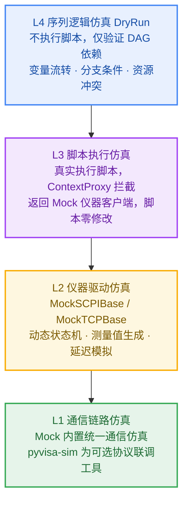

各层定位与组合：

| 层级 | 验证目标 | 数据源/机制 |
|------|----------|-------------|
| L4 DryRun | DAG 依赖、循环展开、分支逻辑、变量流转、资源冲突 | SequenceCompiler + 拓扑排序 + 占位变量 |
| L3 脚本仿真 | 脚本业务逻辑、参数计算、判定阈值 | 真实执行脚本 + ContextProxy 返回 Mock 客户端 |
| L2 驱动仿真 | 驱动 API 行为、状态机、故障响应 | MockSCPIBase / MockTCPBase |
| L1 通信仿真 | 协议实现正确性、超时、乱序 | Mock 基类内置；pyvisa-sim 仅独立联调 |

### 7.3 启用方式

```bash
# 方式1：环境变量（全局）
export ATE_SIMULATION_MODE=true        # 启用 L2+L3
export ATE_SIMULATION_LEVEL=full       # dryrun | script | driver | transport | full

# 方式2：API 触发（按执行实例）
# POST /api/v1/executions
# {
#   "sequence_id": "xxx",
#   "simulation": {
#     "enabled": true,
#     "level": "full",
#     "profile": "power_supply_normal",
#     "uut_count": 4,
#     "fault_injection": [...]
#   }
# }

# 方式3：前端仿真调试控制台一键切换
```

### 7.4 与调度引擎的集成点

| 接入点 | 仿真行为 |
|--------|----------|
| `try_submit()` 资源锁 | 仿真模式下资源锁仍正常竞争，验证互斥逻辑 |
| `execute_step()` 子进程启动 | 注入 `SIMULATION_CONTEXT` 环境变量，脚本据此选择 Mock 驱动 |
| `ContextProxy.get_instrument()` | 仿真模式从 MockDriverFactory 获取虚拟仪器 |
| 步骤超时判定 | 仿真模式时间缩放（time scaling），避免等待真实超时 |
| 变量写入/事件发布 | 完全真实，验证变量传播与条件触发 |

L3 脚本仿真拦截流程：

```
1. 调度器创建 ContextProxy(simulation=True)
2. ContextProxy.get_instrument() → InstrumentClient（连接到代理进程的Mock驱动）
3. 脚本调用仪器方法 → InstrumentClient 通过 IPC → 代理进程 → Mock驱动
4. Mock驱动返回模拟数据 → 脚本正常执行
5. 脚本返回结果 → 调度器记录
关键：脚本代码完全一致，仅 ContextProxy 的 simulation 标志不同
```

### 7.5 虚拟仪器扩展设计

#### 7.5.1 目录结构

```
src/ate_platform/drivers/
├── mock_factory.py              # 工厂入口（扩展）
├── base/
│   └── mock_instrument_base.py  # 虚拟仪器基类：状态机、延迟、故障注入
├── instruments/
│   ├── mock_dmm.py              # 万用表
│   ├── mock_psu.py              # 程控电源
│   ├── mock_electronic_load.py  # 电子负载（CC/CV/CR/CP/动态负载/短路）
│   ├── mock_gpib_gateway.py     # GPIB 网关（寻址/串行轮询/SRQ）
│   └── mock_tcp_device.py       # 可脚本化 TCP 服务器仿真
└── profiles/
    ├── power_supply_normal.yaml # 正常场景
    ├── power_supply_fault.yaml  # 故障场景
    └── noise_profile.yaml       # 噪声配置
```

#### 7.5.2 虚拟仪器基类

```python
class MockInstrumentBase:
    """虚拟仪器基类，提供状态机、延迟模拟、故障注入、测量值生成"""

    def __init__(self, resource_id: str, profile: dict):
        self.resource_id = resource_id
        self.profile = profile
        self._state = "IDLE"
        self._latency_ms = profile.get("latency_ms", 50)
        self._fault_rules = []
        self._call_history = []

    async def _simulate_latency(self):
        """模拟通信延迟，支持高斯分布"""
        mean = self._latency_ms
        std = self.profile.get("latency_std_ms", 10)
        delay = max(0, random.gauss(mean, std)) / 1000
        await asyncio.sleep(delay)

    def _apply_fault(self, command: str, value=None):
        """应用故障注入规则"""
        for rule in self._fault_rules:
            if rule.matches(command, self._state, self._call_count):
                return rule.trigger()
        return False, None, None

    def record_call(self, method: str, args: tuple, kwargs: dict, result):
        self._call_history.append({
            "timestamp": time.time(),
            "method": method,
            "args": args,
            "kwargs": kwargs,
            "result": result,
        })
```

#### 7.5.3 典型虚拟仪器行为模型

- **MockDMM**：读数模型支持 `constant | gaussian | drift | waveform`，含噪声标准差与温漂率；支持 DCV/ACV/DCI/ACI/电阻/二极管/通断。
- **MockPSU**：多通道状态跟踪、电压爬升（ramp_ms）、上电浪涌模拟、OVP/OCP 设定与触发。
- **MockElectronicLoad**：CC/CV/CR/CP/SHORT 五种模式，按被测电源电压计算实际读数；动态负载（双电平切换）测试电源动态响应。
- **MockGPIBGateway**：GPIB 总线互斥、多设备寻址、SCPI 命令解析分发、串行轮询、SRQ 回调。
- **MockTCPDevice**：启动 asyncio TCP 服务器，按协议配置文件（framing + commands 规则）解析请求返回模拟响应。

#### 7.5.4 仿真场景配置（Profile）

```yaml
# profiles/power_supply_12v_5a_normal.yaml
simulation_profile:
  name: "12V/5A 电源正常测试"
  time_scale: 1.0                 # 时间缩放（0.1=加速10倍）

  instruments:
    - resource_id: "PSU_MAIN"
      type: "psu"
      model: "chroma_62012p"
      channels:
        - id: 1
          max_v: 20
          max_i: 10
          initial_v: 12.0
          ramp_ms: 50
      latency_ms: 30
      latency_std_ms: 5

    - resource_id: "ELOAD_MAIN"
      type: "electronic_load"
      model: "chroma_63600"
      source_voltage: 12.0
      max_power: 100
      latency_ms: 20

    - resource_id: "DMM_CH1"
      type: "dmm"
      model: "keysight_34465a"
      reading_model:
        type: "gaussian"
        value: 12.05
        noise_std: 0.008
        drift_rate: 0.00005
      latency_ms: 15

  gpib:
    enabled: true
    board: 0
    devices:
      - address: 1
        instrument: "PSU_MAIN"
      - address: 3
        instrument: "ELOAD_MAIN"

  tcp_devices:
    - name: "custom_relay_board"
      port: 9001
      protocol: "protocols/relay_board.yaml"
```

### 7.6 多 UUT 并行仿真

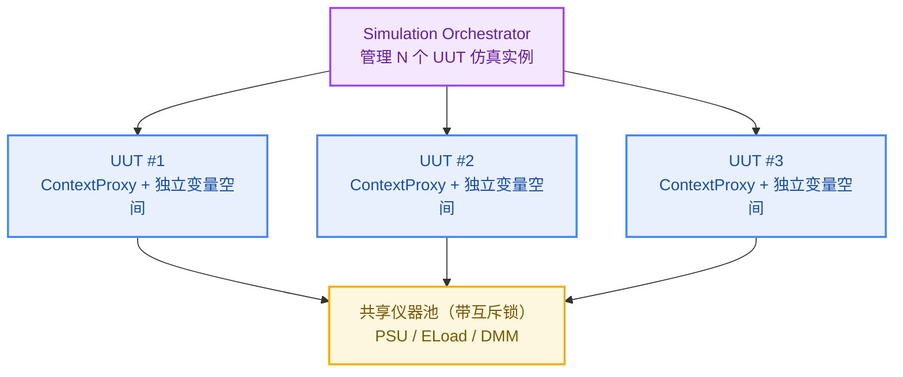

实现要点：
- **实例隔离**：每个 UUT 独立 VariableSpace（`uut_id` 命名空间），独立序列实例，步骤 ID 自动加 `_uut{id}` 后缀；
- **锁行为一致**：共享仪器经 ResourceManager 统一加锁，仿真与真实行为完全一致；
- **个体差异**：`profile_overrides` 按 UUT 覆盖仿真参数（如 source_voltage）；
- **同步点**：`sync_points` 支持 barrier 模式，所有 UUT 到达后同时执行；
- **争用分析**：ResourceContentionAnalyzer 记录锁等待/持有时间、争用次数，输出甘特图与死锁检测报告。

```yaml
simulation:
  uut_count: 4
  uut_configs:
    - uut_id: "UUT001"
      serial_number: "SN20260816001"
      profile_overrides:
        ELOAD_MAIN: { source_voltage: 12.1 }
    - uut_id: "UUT002"
      serial_number: "SN20260816002"
      profile_overrides:
        ELOAD_MAIN: { source_voltage: 11.9 }
  sync_points:
    - step_id: "high_voltage_test"
      mode: "barrier"
      timeout: 120
```

### 7.7 故障注入引擎

#### 7.7.1 故障类型体系（四层注入点）

| 层级 | 注入点 | 故障类型 |
|------|--------|----------|
| 网络层 L1 | Mock 基类 `_apply_network_fault` / 代理层 | 延迟、丢包、断连、乱序、校验错误 |
| 协议层 L1 | Mock 基类 `_generate_response` | SCPI 错误码、截断数据 |
| 仪器层 L2 | Mock 基类 `_check_fault` | 测量越界、读数漂移、模式切换失败、自检失败 |
| DUT 层 L2/L3 | Profile 覆盖 | 输出电压偏低、纹波过大、启动失败、保护误触发 |
| 调度层 L3/L4 | 调度器 `_execute_step` | 步骤异常退出、变量污染、资源死锁 |

#### 7.7.2 故障规则 DSL

```yaml
fault_injection:
  - id: "dmm_timeout_once"
    target: "DMM_CH1"
    method: "measure_voltage"
    trigger:
      type: "count"          # count | probability | time | state
      value: 3               # 第3次调用时触发
    fault:
      type: "timeout"
      timeout_ms: 5000

  - id: "eload_random_error"
    target: "ELOAD_MAIN"
    method: "*"
    trigger:
      type: "probability"
      value: 0.05
    fault:
      type: "instrument_error"
      code: -113
      message: "Undefined header"

  - id: "dut_voltage_drop"
    target: "PSU_MAIN"
    method: "measure_voltage"
    trigger:
      type: "time"
      after_s: 30
    fault:
      type: "value_override"
      field: "measured_v"
      value: 10.5
      duration_s: 5

  - id: "gpib_bus_collision"
    target: "GPIB_BUS"
    trigger:
      type: "state"
      condition: "active_devices > 2"
    fault:
      type: "bus_error"
```

#### 7.7.3 引擎实现

```python
class FaultRule:
    """故障规则定义"""
    def __init__(self, fault_id, layer, target, trigger, action):
        self.fault_id = fault_id
        self.layer = layer        # network | protocol | instrument | scheduler
        self.target = target      # resource_id or step_id
        self.trigger = trigger    # {type: time/count/probability/condition, ...}
        self.action = action      # {type: exception/value_override/delay, ...}
        self._triggered_count = 0

    def matches(self, context: dict) -> bool:
        t = self.trigger
        if t["type"] == "time":
            return context.get("elapsed_s", 0) >= t.get("after_s", 0)
        if t["type"] == "count":
            return context.get("call_count", 0) >= t.get("value", 0)
        if t["type"] == "probability":
            return random.random() < t.get("value", 0)
        if t["type"] == "condition":
            return eval(t.get("expression", "False"), {}, context)
        return False

class FaultInjector:
    def __init__(self):
        self.rules = []

    def load(self, config: list):
        for rule_cfg in config:
            self.rules.append(FaultRule(**rule_cfg))

    def check_network(self, resource_id: str, context: dict):
        for rule in self.rules:
            if rule.layer == "network" and rule.target == resource_id and rule.matches(context):
                return rule.action

    def check_instrument(self, resource_id: str, method: str, context: dict):
        for rule in self.rules:
            if rule.layer == "instrument" and rule.target == resource_id and rule.matches(context):
                return rule.action
```

### 7.8 L4 DryRun 验证器

```python
# src/ate_platform/simulation/dry_runner.py
class DryRunner:
    """序列级DryRun：不执行脚本，快速验证序列逻辑正确性"""

    def __init__(self, plan: dict):
        self.plan = plan
        self.compiler = SequenceCompiler(plan)

    def run(self) -> dict:
        steps = self.compiler.compile()
        errors = []
        warnings = []

        # 1. 检查循环引用
        if self._has_circular_dependency(steps):
            errors.append("Circular dependency detected")

        # 2. 检查所有依赖的步骤存在
        step_ids = {s["id"] for s in steps}
        for s in steps:
            for dep in s["depends_on"]:
                if dep not in step_ids:
                    errors.append(f"Step {s['id']} depends on unknown step {dep}")

        # 3. 模拟变量流转（用占位值）
        variable_space = {}
        for s in self._topological_sort(steps):
            for var_write in s.get("params", {}).get("writes", []):
                variable_space[var_write] = "<simulated>"
            for var_read in s.get("params", {}).get("reads", []):
                if var_read not in variable_space:
                    warnings.append(f"Step {s['id']} reads undefined variable {var_read}")

        # 4. 检查资源冲突（同一仪器被并行步骤使用且无互斥声明）
        resource_usage = {}
        for s in steps:
            for res in s.get("resources", []):
                resource_usage.setdefault(res, []).append(s["id"])

        return {
            "valid": len(errors) == 0,
            "errors": errors,
            "warnings": warnings,
            "step_count": len(steps),
            "estimated_duration": self._estimate_duration(steps),
        }
```

### 7.9 录制/回放与差异对比

#### 7.9.1 录制机制

V3.2 架构下录制数据源已就绪：InstrumentProxy 的调用日志（JSONL）。录制拦截器补充步骤与变量事件：

```python
class RecordingInterceptor:
    """录制拦截器，挂载在 ContextProxy 和仪器驱动层"""

    def __init__(self, execution_id: str):
        self.execution_id = execution_id
        self._events = []
        self._start_time = time.time()

    def record_instrument_call(self, resource_id, method, args, result, duration_ms):
        self._events.append({
            "type": "instrument_call",
            "t": round(time.time() - self._start_time, 3),
            "resource_id": resource_id,
            "method": method,
            "args": self._sanitize(args),
            "result": self._sanitize(result),
            "duration_ms": duration_ms,
        })

    def record_step_event(self, step_id, event, data):
        self._events.append({
            "type": f"step_{event}",
            "t": round(time.time() - self._start_time, 3),
            "step_id": step_id,
            "data": data,
        })

    def record_variable_change(self, name, old, new):
        self._events.append({
            "type": "variable_change",
            "t": round(time.time() - self._start_time, 3),
            "name": name, "old": old, "new": new,
        })
```

#### 7.9.2 回放引擎

```python
class ReplayEngine:
    """回放引擎：根据录制文件驱动仿真执行"""

    def __init__(self, recording: dict, strict: bool = True):
        self.recording = recording
        self.strict = strict          # 严格模式：调用序列必须完全匹配
        self._call_index = {}         # per (resource, method) 调用计数

    def get_mock_response(self, resource_id: str, method: str, args: dict):
        """根据录制数据返回模拟响应"""
        key = (resource_id, method)
        idx = self._call_index.get(key, 0)
        for event in self.recording["events"]:
            if (event["type"] == "instrument_call" and
                event["resource_id"] == resource_id and
                event["method"] == method):
                if idx == 0:
                    self._call_index[key] = idx + 1
                    if self.strict:
                        self._validate_args(event["args"], args)
                    return event["result"]
                idx -= 1
        if self.strict:
            raise ReplayMismatchError(f"No recording for {resource_id}.{method}")
        return None
```

#### 7.9.3 差异对比

`ExecutionDiff.compare(exec_a, exec_b)` 对比步骤结果、测量值（容差内）、时序偏差、资源使用与变量，输出摘要供前端并排视图展示。

### 7.10 CI/CD 集成

```yaml
# .github/workflows/simulation-test.yml
jobs:
  simulation-test:
    runs-on: ubuntu-latest
    steps:
      - uses: actions/checkout@v4
      - name: Run simulation tests
        run: |
          python -m ate_platform.simulation.runner \
            --sequence sequences/power_supply_full_test.yaml \
            --profile profiles/power_supply_normal.yaml \
            --uut-count 4 \
            --fault-injection faults/comm_timeout.yaml \
            --junit-output results/simulation.xml \
            --html-report results/simulation.html
      - name: Upload results
        uses: actions/upload-artifact@v4
        with:
          name: simulation-report
          path: results/
```

仿真覆盖率统计：步骤覆盖率与分支覆盖率作为序列质量指标（SimulationCoverage.report）。

### 7.11 验收标准

| 验收项 | 标准 |
|--------|------|
| 零硬件运行 | `ATE_SIMULATION_MODE=true` 下完整电源产测序列端到端执行通过 |
| 仪器覆盖 | DMM / PSU / ELoad / GPIB / TCP 五类虚拟仪器均可用，API 与真实驱动 100% 兼容 |
| 多UUT并行 | 4 UUT 同时仿真，互斥逻辑正确，无死锁 |
| 故障注入 | ≥8 种故障类型，支持次数/概率/时间/状态触发 |
| 录制回放 | 真实执行录制后可回放，测量值偏差 < 1%（容差内） |
| CI集成 | 无头仿真输出 JUnit 报告，接入流水线 |

### 7.12 典型仿真场景

| 场景 | 配置要点 | 验证点 |
|------|----------|--------|
| 12V/5A 电源完整产测 | 12V 正常输出，电子负载 0–5A 步进 | 上电时序、空载电压、负载调整率、纹波、OCP、效率 |
| 多UUT并行老化 | 4 UUT 共享一台 4 通道电子负载 | 通道互斥、同步启动、个体差异 |
| 通信异常容错 | DMM 第 5 次测量超时、GPIB 10% 概率报错 | 重试、超时熔断、失败策略 |
| DUT 故障诊断 | 输出电压偏低 10%、纹波噪声增大 3 倍 | 判定阈值、故障分类、AI 诊断 RAG 召回 |

---

## 8. 前端可视化系统

### 8.1 前端总体架构

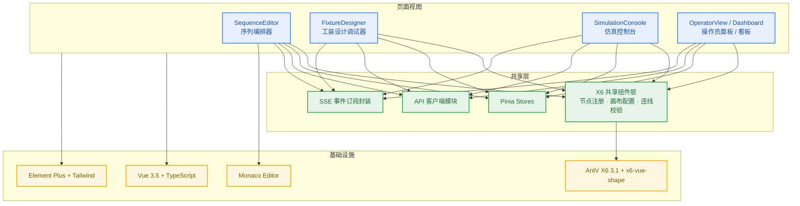

> 工装调试器与序列编排器统一技术栈，抽取 X6 共享组件层（约 1 人日），复用节点/边/画布基础设施。

> **实现备注(2026-08)：** 操作员面板的实际前端路由是站级作用域的 `/operator/:station_id`（`frontend/src/router/index.ts`），为独立页面、不套 AppLayout 侧边栏，`props: true` 将 station_id 直接传入视图。导航入口并非 `/monitor/operator`：DB 菜单种子 `src/ate_cloud/api/v1/apps.py`（RH-5）在"执行监控"应用下播种"操作员面板"菜单，其 `route_path` 指向具体默认站路径 `/operator/default`（动态段 `:station_id` 会在菜单点击时被 AppLayout 剥离，故种子数据使用具体路径而非参数路径）。

### 8.2 序列编排器（SequenceEditor）

#### 8.2.1 目录结构

```
frontend/src/views/SequenceEditor/
├── index.vue                 # 主编辑器入口
├── components/
│   ├── GraphContainer.vue    # X6 画布容器
│   ├── StepLibraryPanel.vue  # 左侧步骤库面板（可用脚本）
│   ├── PropertyPanel.vue     # 右侧属性面板（参数、条件等）
│   ├── Toolbar.vue           # 顶部工具栏
│   └── nodes/
│       ├── ScriptStepNode.vue       # 脚本步骤节点
│       ├── VariableNode.vue         # 变量定义节点
│       └── LoopContainerNode.vue    # 循环容器节点（语法糖）
├── composables/
│   ├── useGraph.ts           # Graph 实例管理与生命周期
│   ├── useNodeRegistry.ts    # 节点注册
│   ├── useDnd.ts             # 拖拽（从步骤库拖入脚本）
│   ├── useSerializer.ts      # X6 ↔ YAML 双向转换
│   └── useDependencyCheck.ts # 循环依赖检测
├── models/
└── types/
```

#### 8.2.2 依赖与全局注册

```json
{
  "dependencies": {
    "@antv/x6": "^3.0.0",
    "@antv/x6-vue-shape": "^3.0.0"
  }
}
```

> X6 3.x 将所有插件（`@antv/x6-plugin-*`、工具包、几何包）合并入主包统一导出，无需单独安装插件包。

```typescript
// main.ts —— 全局注册 Vue 节点
import { register } from '@antv/x6-vue-shape'
import ScriptStepNode from './views/SequenceEditor/components/nodes/ScriptStepNode.vue'
import VariableNode from './views/SequenceEditor/components/nodes/VariableNode.vue'
import LoopContainerNode from './views/SequenceEditor/components/nodes/LoopContainerNode.vue'

register({ shape: 'script-step-node', width: 180, height: 80, component: ScriptStepNode })
register({ shape: 'variable-node', width: 200, height: 120, component: VariableNode })
register({ shape: 'loop-container-node', width: 240, height: 160, component: LoopContainerNode })
```

App.vue 必须挂载 `getTeleport()` 返回的 TeleportContainer。

#### 8.2.3 画布初始化（useGraph.ts 要点）

```typescript
graph.value = new Graph({
  container: container.value,
  grid: { size: 10, visible: true },
  panning: { enabled: true, modifiers: 'shift' },
  mousewheel: { enabled: true, modifiers: 'ctrl', minScale: 0.5, maxScale: 2.0 },
  connecting: {
    snap: { radius: 20 },
    allowBlank: false,
    allowLoop: false,          // 防止自依赖
    allowMulti: true,
    router: 'manhattan',
    connector: { name: 'rounded', args: { radius: 8 } },
    validateConnection({ sourceCell, targetCell }) {
      // 禁止自连 + 循环依赖检测
      return sourceCell.id !== targetCell.id
        && !wouldCreateCycle(graph.value!, sourceCell, targetCell)
    }
  },
  highlighting: { default: { name: 'stroke', args: { padding: 4, attrs: { 'stroke-width': 2, stroke: '#409EFF' } } } }
})

graph.value.use(new Scroller({ pageWidth: 2000, pageHeight: 2000, virtual: true }))
graph.value.use(new Selection({ rubberband: true, multiple: true }))
graph.value.use(new Keyboard({ enabled: true, global: true }))
graph.value.use(new History({ enabled: true }))
graph.value.use(new Clipboard())
graph.value.use(new Snapline({ enabled: true, sharp: true }))
graph.value.use(new MiniMap({ container: minimapEl, width: 200, height: 150, padding: 10 }))
```

#### 8.2.4 X6 ↔ YAML 序列化

`useSerializer.ts` 实现双向转换（graphToYaml / yamlToGraphData）：入边收集为 `preconditions`，`variable-node` 合并入 `scope.variables`，`preconditions` 反向还原为边。核心接口：

```typescript
export interface YamlStep {
  id: string
  script: string
  params?: Record<string, any>
  preconditions?: any
  resources?: string[]
  timeout?: number
  retry?: number
  on_fail?: string
  export_outputs?: boolean
  type?: string
  child?: any
}

export interface YamlPlan {
  name: string
  version: string
  scope?: { variables?: Record<string, any>; resources?: string[] }
  max_concurrency?: number
  steps: YamlStep[]
}
```

#### 8.2.5 面板职责

| 面板 | 职责 |
|------|------|
| StepLibraryPanel | 后端拉取脚本库（名称/版本/描述/所需资源），拖拽入画布创建步骤，支持搜索筛选 |
| PropertyPanel | 按节点类型动态表单：步骤参数、前置条件（Monaco JSON）、超时、失败策略、资源、导出开关 |
| Toolbar | 新建/打开/保存/校验/DryRun/执行/撤销重做 |

#### 8.2.6 X6 3.x 迁移要点

| 变更项 | 2.x 写法 | 3.x 写法 |
|--------|----------|----------|
| 插件导入 | `import { Scroller } from '@antv/x6-plugin-scroller'` | `import { Scroller } from '@antv/x6'` |
| Vue Shape | `@antv/x6-vue-shape@^2.x` | `@antv/x6-vue-shape@^3.x` |
| 动画 API | `node.transition(...)` | `node.animate(...)` |
| panning 默认 | `enabled: false` | `enabled: true` |
| 虚拟渲染 | 不支持 | `Scroller` 中 `virtual: true` |

### 8.3 工装设计调试器（FixtureDesigner）

#### 8.3.1 功能定位

拖拽式搭建仪器→夹具→DUT 完整接线拓扑；配置阶段做 8 类接线校验；运行阶段实时高亮活跃链路、仪器/夹具/继电器状态与测量值；失败时故障定位与修复建议；仿真模式下拓扑驱动虚拟仪器初始化并支持链路级故障注入。

#### 8.3.2 工装拓扑数据模型（核心实体）

```typescript
// ========== 仪器仪表 ==========
interface Instrument {
  id: string                    // 如 "PSU_MAIN"
  name: string
  type: 'psu' | 'dmm' | 'eload' | 'oscilloscope' | 'gpib_gateway' | 'tcp_device' | 'custom'
  model: string                 // 如 "Chroma 62012P"
  manufacturer: string
  communication: {
    type: 'gpib' | 'tcp' | 'serial' | 'usb' | 'custom'
    address?: string
    port?: number
    config?: Record<string, any>
  }
  channels: Channel[]
  status: DeviceStatus
  position: { x: number; y: number }
  simulation_profile?: string
}

interface Channel {
  id: string
  name: string
  type: 'voltage' | 'current' | 'resistance' | 'digital_io' | 'rf' | 'thermal'
  direction: 'input' | 'output' | 'bidirectional'
  specs?: Record<string, any>
  status: ChannelStatus
}

// ========== 夹具 ==========
interface Fixture {
  id: string
  name: string
  version: string
  terminals: Terminal[]         // 外部接线端子
  relays: Relay[]               // 内部继电器矩阵
  sensors: Sensor[]             // 气缸位置、温度等
  actuators: Actuator[]         // 气缸、电机
  status: FixtureStatus
  dut_slot_count: number
  position: { x: number; y: number }
}

interface Relay {
  id: string
  type: 'spst' | 'spdt' | 'dpdt' | 'matrix'
  control_signal: string
  contacts: { common: string; no?: string; nc?: string }
  state: 'open' | 'closed'
}

interface Actuator {
  id: string
  type: 'cylinder' | 'motor' | 'valve'
  controlMethod: 'gpio' | 'modbus' | 'tcp'
  state: 'idle' | 'moving' | 'active'
}

interface Sensor {
  id: string
  type: 'position' | 'temperature' | 'pressure' | 'proximity' | 'optical'
  unit: string
  value?: number
  range?: { min: number; max: number }
}

// ========== 被测产品 ==========
interface DUT {
  id: string
  product_model: string
  serial_number?: string        // 运行时绑定
  test_points: TestPoint[]
  power_pins: PowerPin[]
  uutIndex: number              // 多UUT时的索引
  slot_index: number
  status: DUTStatus
  measurements: Record<string, MeasurementValue>
}

interface TestPoint {
  id: string
  net: string
  type: 'voltage' | 'current' | 'resistance' | 'frequency' | 'digital'
  expected_range?: { min: number; max: number }
  measured_value?: number
  status: 'idle' | 'measuring' | 'pass' | 'fail' | 'skip'
}

// ========== 接线与信号路径 ==========
interface Link {
  id: string
  from: LinkEndpoint
  to: LinkEndpoint
  signal_type: 'power' | 'signal' | 'ground' | 'rf' | 'thermal' | 'air'
  wire_gauge?: string
  max_current?: number
  routeId?: string              // 关联的矩阵开关路由
  status: LinkStatus            // idle | active | fault
  fault_info?: FaultInfo
}

interface LinkEndpoint {
  entity_type: 'instrument_channel' | 'fixture_terminal' | 'dut_testpoint' | 'relay_contact'
  entity_id: string
  port_id: string
}

interface Route {
  id: string
  name: string                  // 如 "VOUT 测量路径"
  links: string[]
  relays: string[]              // 需闭合的继电器
  active: boolean
  associated_step?: string      // 关联测试步骤ID
}

interface FaultInfo {
  type: 'open_circuit' | 'short_circuit' | 'over_voltage' | 'over_current'
      | 'communication' | 'measurement_out_of_range' | 'relay_fault'
  severity: 'warning' | 'error' | 'critical'
  message: string
  detected_at: number
  detected_by: string
  suggestion?: string
}

interface FixtureTopology {
  id: string
  name: string
  version: string
  product_model: string
  instruments: Instrument[]
  fixtures: Fixture[]
  duts: DUT[]
  links: Link[]
  routes: Route[]
  created_at: string
  updated_at: string
  tags: string[]
}
```

实体关系总览：

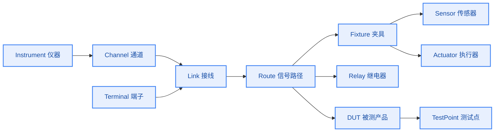

#### 8.3.3 界面布局

```
┌──────────────────────────────────────────────────────────────────────┐
│  工具栏：[新建] [打开] [保存] [校验] [仿真] [运行] [布局] [缩放] [导出] │
├──────────┬───────────────────────────────────────────┬───────────────┤
│ 设备库    │              拓扑画布 (X6)                 │  属性配置面板  │
│ 仪器/夹具 │   PSU ──▶ Fixture(继电器矩阵) ──▶ DUT     │  选中元素属性  │
│ DUT/接线  │   DMM ──▶ Fixture             ──▶ DUT     │  仪器/通道    │
│ 模板      │   ELoad ─▶ Fixture                        │  端子/继电器  │
│          │  画布底部：链路列表 / 信号路径 / 校验结果    │  运行时状态   │
└──────────┴───────────────────────────────────────────┴───────────────┘
```

#### 8.3.4 连线样式（信号类型 × 运行时状态）

```typescript
const LINK_STYLES = {
  power:    { stroke: '#E6A23C', strokeWidth: 3, endArrow: true },
  signal:   { stroke: '#409EFF', strokeWidth: 2, endArrow: true },
  ground:   { stroke: '#606266', strokeWidth: 2, endArrow: false },
  rf:       { stroke: '#9B59B6', strokeWidth: 2, endArrow: true, dash: '4 2' },
  thermal:  { stroke: '#F56C6C', strokeWidth: 2, endArrow: true },
  air:      { stroke: '#67C23A', strokeWidth: 2, endArrow: true, dash: '6 3' },
}

const LINK_STATE_STYLES = {
  idle:    { opacity: 0.5 },
  active:  { opacity: 1.0, animation: 'flow 1.5s linear infinite' },
  fault:   { stroke: '#F56C6C', strokeWidth: 4, animation: 'blink 0.8s infinite' },
  warning: { stroke: '#E6A23C', strokeWidth: 3 },
}
```

#### 8.3.5 接线校验引擎（8 类检查）

| 检查项 | 级别 | 说明 |
|--------|------|------|
| 端口类型匹配 | error | 电源输出→电源输入，信号输出→信号输入 |
| 信号方向 | error | source 必须输出端口，target 必须输入端口 |
| 短路/通道冲突 | error | 同一输入端口不能被多条连线连接；仪器通道接多条链路需继电器隔离 |
| 接地完整性 | warning | 电源回路必须有地线连接；检查接地环路 |
| 仪器通道占用 | error | 同一通道不能同时接多个 DUT 测试点（除非矩阵开关） |
| 矩阵开关路由可达 | error | 声明 routeId 的连线必须有对应继电器路径 |
| 夹具控制完整性 | error | 夹具气缸/继电器必须有控制源连接 |
| DUT 测试点覆盖 | warning | 产品规格要求的测试点必须全部接线 |

辅助检查：电源容量校验（链路 max_current 与通道额定）、GPIB 地址冲突（error）。

```typescript
class TopologyValidator {
  validate(topology: FixtureTopology): ValidationResult {
    const errors: ValidationIssue[] = []
    const warnings: ValidationIssue[] = []
    this.checkUnconnectedPorts(topology, warnings)
    this.checkSignalTypeMismatch(topology, errors)
    this.checkChannelConflict(topology, errors)
    this.checkGroundLoops(topology, warnings)
    this.checkRouteCompleteness(topology, errors)
    this.checkPowerCapacity(topology, warnings)
    this.checkDutCoverage(topology, warnings)
    this.checkGpibAddressConflict(topology, errors)
    return { valid: errors.length === 0, errors, warnings,
             summary: `${errors.length} 错误, ${warnings.length} 警告` }
  }
}
```

#### 8.3.6 运行时状态显示

链路状态机：

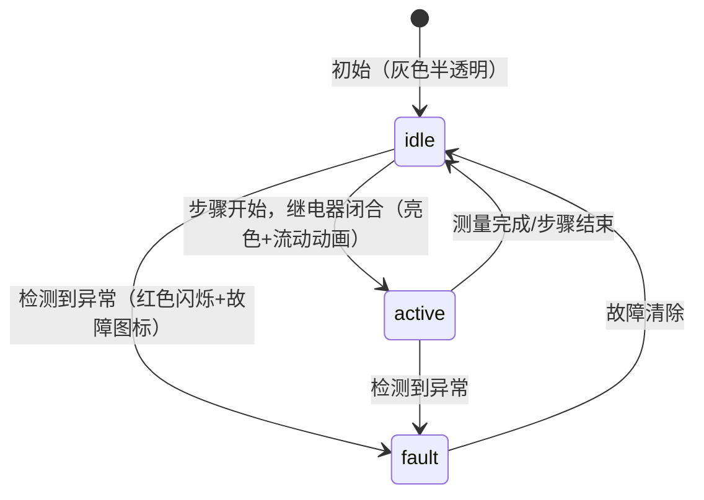

前端 SSE 订阅与 Store（Pinia）：

```typescript
// stores/topology-runtime.ts
export const useTopologyRuntimeStore = defineStore('topologyRuntime', () => {
  const topology = ref<FixtureTopology | null>(null)
  const faults = ref<FaultInfo[]>([])
  let eventSource: EventSource | null = null

  function connect(execId: string) {
    eventSource = new EventSource(`/api/v1/executions/${execId}/topology-stream`)
    eventSource.addEventListener('instrument', (e) => {
      const data = JSON.parse(e.data)
      updateInstrumentStatus(data.instrument_id, data.status)
    })
    eventSource.addEventListener('link', (e) => {
      const data = JSON.parse(e.data)
      updateLinkStatus(data.link_id, data.active ? 'active' : 'idle')
    })
    eventSource.addEventListener('relay', (e) => {
      const data = JSON.parse(e.data)
      updateRelayState(data.relay_id, data.state)
    })
    eventSource.addEventListener('measurement', (e) => {
      const data = JSON.parse(e.data)
      updateMeasurement(data.dut_id, data.testpoint_id, data.value, data.status)
    })
    eventSource.addEventListener('fault', (e) => {
      const data = JSON.parse(e.data)
      addFault(data.fault, data.location)
      highlightFaultLocation(data.location)
    })
  }
  return { topology, faults, connect }
})
```

节点显示信息：
- **仪器节点**：型号、资源 ID、状态灯、当前通道读数；busy/error 边框高亮
- **夹具节点**：夹紧状态、气缸位置、继电器矩阵（闭合●/断开○）、传感器实时值、DUT 槽位
- **DUT 节点**：产品型号、UUT 编号、SN、测试进度、各测试点测量值与 PASS/FAIL

信号路径高亮（RouteHighlighter）：步骤执行时计算并高亮完整路径（仪器通道→夹具端子→继电器→夹具端子→DUT 测试点），其余链路淡化。

#### 8.3.7 故障定位视图

故障定位策略（FaultLocalizer）：

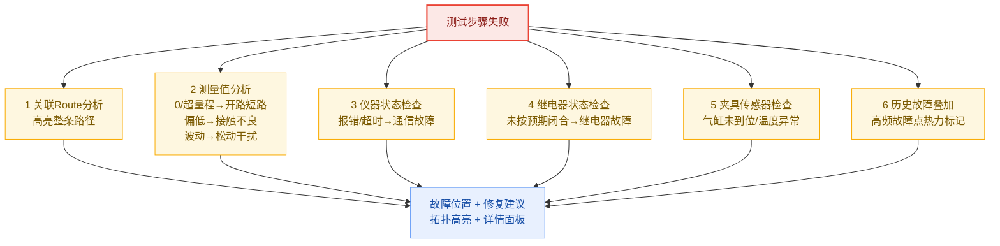

故障可视化效果映射：

| 故障类型 | 可视化效果 |
|----------|-----------|
| 链路开路 | Link 红闪 + "✕ 开路"标记，两端端口变红 |
| 链路短路 | 相关 Link 全部变红 + "⚡ 短路"标记，关联电源通道标红 |
| 仪器通信故障 | 仪器节点边框红闪 + 错误码，通信链路虚线变红 |
| 继电器故障 | 继电器指示器红闪 + "卡滞"，控制信号链路变红 |
| 测量越界 | DUT 测试点变红，显示实测值与期望范围，测量路径高亮 |
| 夹具异常 | 夹具整体红框，异常传感器读数变红 |
| DUT 故障 | DUT 节点红框，故障测试点持续闪烁 + FAIL 标签 |

后端故障定位器：

```python
# src/ate_platform/runtime/fault_localizer.py
class FaultLocalizer:
    """根据测试失败信息，在工装拓扑中定位故障位置"""

    def __init__(self, topology: FixtureTopology):
        self.topology = topology

    def localize(self, step_result: dict) -> List[FaultLocation]:
        locations = []
        routes = self._find_routes_for_step(step_result['step_id'])
        for route in routes:
            if 'measurement' in step_result:
                meas_loc = self._analyze_measurement(route, step_result['measurement'])
                if meas_loc:
                    locations.append(meas_loc)
            inst_loc = self._check_instrument_status(route)
            if inst_loc:
                locations.append(inst_loc)
            relay_loc = self._check_relay_states(route, step_result)
            if relay_loc:
                locations.append(relay_loc)
        sensor_loc = self._check_fixture_sensors()
        if sensor_loc:
            locations.append(sensor_loc)
        return locations

    def _analyze_measurement(self, route, measurement) -> FaultLocation | None:
        tp_id = measurement['testpoint_id']
        expected = measurement['expected_range']
        actual = measurement['value']

        if actual == 0 or actual is None:
            return FaultLocation(
                type='open_circuit',
                route_id=route.id,
                suspect_links=route.links,
                suspect_relays=route.relays,
                message=f"测试点 {tp_id} 测量值为零，疑似链路开路",
                suggestion="检查接线是否松动、继电器是否正常闭合、DUT是否正确放入",
            )
        elif actual < expected['min']:
            return FaultLocation(
                type='under_range', testpoint_id=tp_id,
                message=f"测量值 {actual} 低于下限 {expected['min']}",
                suggestion="检查DUT输出是否正常、接触电阻是否过大",
            )
        elif actual > expected['max']:
            return FaultLocation(
                type='over_range', testpoint_id=tp_id,
                message=f"测量值 {actual} 高于上限 {expected['max']}",
                suggestion="检查电源设定值、DUT是否存在过压故障",
            )
        return None
```

#### 8.3.8 拓扑驱动仿真初始化与链路故障注入

```python
# src/ate_platform/simulation/topology_driven_init.py
class TopologyDrivenSimulation:
    """根据工装拓扑配置初始化仿真环境"""

    def __init__(self, topology: FixtureTopology):
        self.topology = topology
        self.mock_factory = MockDriverFactory()
        self.gpib_gateways = {}
        self.tcp_servers = {}

    async def initialize(self):
        # 1. 初始化所有虚拟仪器（GPIB 设备挂载到对应网关）
        for inst in self.topology.instruments:
            if inst.type == 'gpib_gateway':
                self.gpib_gateways[inst.id] = MockGPIBGateway(
                    board_index=inst.communication.address)
            else:
                mock = self.mock_factory.create(
                    instrument_type=inst.type,
                    resource_id=inst.id,
                    profile=inst.simulation_profile or 'default',
                )
                if inst.communication.type == 'gpib':
                    gateway = self._find_gpib_gateway(inst)
                    if gateway:
                        gateway.attach_device(inst.communication.address, mock)

        # 2. 启动虚拟 TCP 设备（动态分配端口并回写拓扑）
        for inst in self.topology.instruments:
            if inst.communication.type == 'tcp':
                server = MockTCPDevice(host='127.0.0.1',
                                       port=inst.communication.port or 0)
                port = await server.start()
                self.tcp_servers[inst.id] = server
                inst.communication.port = port

        # 3. 校验接线连通性（仿真模式）
        self._validate_links_in_simulation()
```

仿真模式下拓扑图右键链路可直接注入故障（开路/短路/接触电阻增大/信号噪声），注入动作转发到对应虚拟仪器驱动层并更新链路状态。

### 8.4 仿真调试控制台

| 模块 | 功能 |
|------|------|
| 仿真配置面板 | 选择仿真层级、加载 Profile、配置 UUT 数量、设置故障注入规则 |
| 执行控制 | 启动/暂停/单步/停止，支持断点（步骤级、仪器调用级） |
| 实时状态视图 | 步骤状态流转动画（复用 X6 节点状态）、变量监视器、仪器状态面板 |
| 仪器时间线 | 甘特图展示各仪器占用/空闲/等待时间线 |
| 调用日志 | 所有仪器调用详情（请求/响应/延迟/状态），筛选与搜索 |
| 故障注入面板 | 运行时手动注入故障 |
| 对比视图 | 本次仿真 vs 历史执行/录制基线差异对比 |
| 仿真报告 | 执行摘要、资源争用分析、故障触发记录、覆盖率统计 |

断点与单步：

```typescript
interface SimulationBreakpoint {
  id: string
  type: 'step' | 'instrument_call' | 'variable_change' | 'condition'
  target: string           // step_id 或 "resource_id.method"
  condition?: string
  enabled: boolean
  hitCount: number
}
type StepMode = 'step_over' | 'step_into' | 'step_out' | 'run_to_cursor'
```

后端通过 SSE 推送断点命中事件，前端暂停执行并展示当前上下文（变量、仪器状态、调用栈）。

---

## 9. 云侧服务设计

### 9.1 服务组成

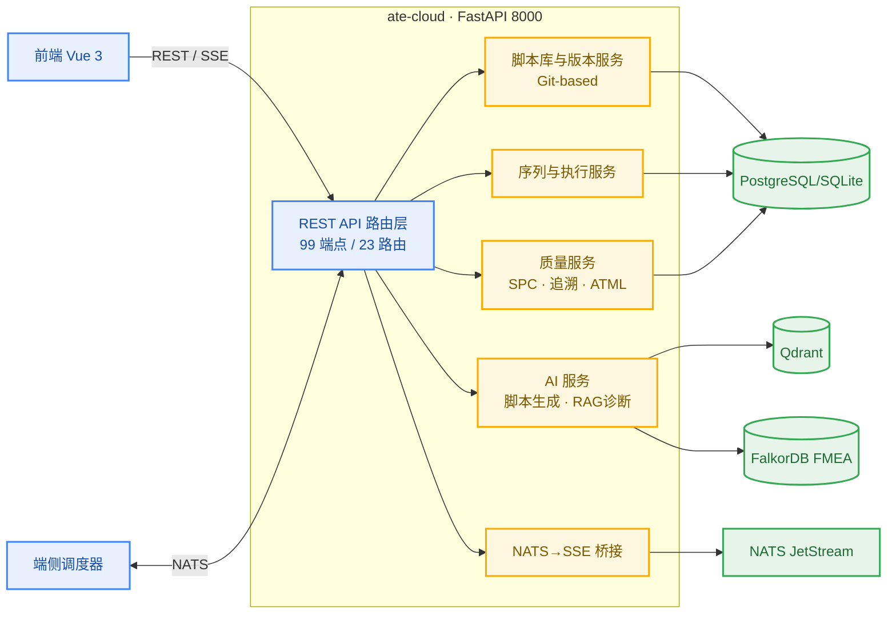

### 9.2 主要 API 域

| API 域 | 前缀 | 关键端点 |
|--------|------|----------|
| health | `/` | 健康检查 |
| node_templates | `/node-templates` | 图编辑器节点模板 CRUD |
| scripts | `/scripts` | 脚本 CRUD + 内容读写 + 版本管理（9 端点） |
| scripts_generate | `/scripts` | AI 脚本生成 /generate、/refine |
| sequences | `/sequences` | 序列 CRUD |
| executions | `/executions` | 启动/列表/搜索/中止/SSE 事件流 |
| changeover | `/changeover` | 换型优化（CP-SAT 求解） |
| dashboard | `/dashboard` | 生产看板汇总 |
| resources | `/resources` | 人力/机器人资源管理 |
| reports | `/reports` | ATML 报告导出 |
| fixtures | `/api/v1/fixtures` | 工装拓扑 CRUD + validate + duplicate + versions + export |
| fixtures/templates | `/api/v1/fixtures/templates` | 设备模板库 |
| auth / calibrations / debug / diagnose / faults / limits / operator_checkpoints / products / recordings / spc / trace / workers / workflows | — | 已实现待挂载（见 13.3） |

工装拓扑 API 明细：

```
GET    /api/v1/fixtures                      # 工装列表
POST   /api/v1/fixtures                      # 创建工装配置
GET    /api/v1/fixtures/{id}                 # 工装详情
PUT    /api/v1/fixtures/{id}                 # 更新
DELETE /api/v1/fixtures/{id}                 # 删除
POST   /api/v1/fixtures/{id}/validate        # 校验拓扑合法性
POST   /api/v1/fixtures/{id}/duplicate       # 复制
GET    /api/v1/fixtures/{id}/versions        # 版本历史
POST   /api/v1/fixtures/{id}/export          # 导出 JSON/YAML

GET    /api/v1/executions/{id}/topology         # 执行时拓扑快照
GET    /api/v1/executions/{id}/topology-stream  # SSE 实时状态流
POST   /api/v1/executions/{id}/fault-injection  # 运行时注入故障
```

> **实现备注(2026-08)：** 操作员检查点确认已支持双路径（RH-6，提交 `8aa03fd`）：运行作用域路径 `POST /api/v1/executions/{run_id}/checkpoint/ack` 与按稳定 id 的别名路径 `POST /api/v1/checkpoints/{checkpoint_id}/ack`，均在 `src/ate_cloud/api/v1/operator_checkpoints.py`。checkpoint_id 是云侧首次观测到待处理检查点时分配的 uuid4 hex（经 `GET .../checkpoint/pending` 或 `OPERATOR_CHECKPOINT` SSE 事件下发），别名路径通过 `app.state.checkpoint_index` 反查 `(run_id, step_id)` 后委托同一 `_ack_checkpoint` 逻辑，因此两条路径响应结构与 `OPERATOR_CHECKPOINT_RESOLVED` SSE 载荷完全一致。错误语义：未知 id 返回 404、重复确认/无待处理检查点返回 409、缺少 operator 字段由 schema 校验返回 422。

脚本库管理 API：

- `POST /api/scripts/upload`：上传脚本，解析元数据入 PostgreSQL，文件存磁盘
- `GET /api/scripts`：列表（标签、关键词检索）
- `GET /api/scripts/{id}` / `PUT /api/scripts/{id}` / `DELETE /api/scripts/{id}`：详情、更新版本、下架

### 9.3 AI 能力设计

| 能力 | 实现 | 说明 |
|------|------|------|
| 脚本生成/润色 | DeepAgents + LLM（DeepSeek/Qwen 开源模型） | POST /scripts/generate、/refine |
| 序列辅助生成 | RAG 检索相似依赖模式 | 依赖驱动模型下 AI 只需预测步骤间依赖，DSL 生成更简单可靠 |
| 故障诊断 | Qdrant 向量检索 + FalkorDB FMEA 知识图谱混合检索 | 100+ 种子故障记录，知识图谱持续演化 |
| Embedding | BAAI/bge-m3 等，维度 1536（可配置） | — |

Qdrant 选型依据见 4.4.4（p95 延迟优 39%，QPS 优 291%）。

### 9.4 数据库设计

#### 9.4.1 工装拓扑表

```sql
-- 工装配置主表
CREATE TABLE fixture_topologies (
    id          UUID PRIMARY KEY DEFAULT gen_random_uuid(),
    name        VARCHAR(200) NOT NULL,
    version     VARCHAR(50) NOT NULL DEFAULT '1.0',
    description TEXT,
    product_model VARCHAR(100),
    topology_data JSONB NOT NULL,        -- 完整拓扑数据（instruments/fixtures/duts/links/routes）
    created_by  VARCHAR(100),
    created_at  TIMESTAMPTZ DEFAULT NOW(),
    updated_at  TIMESTAMPTZ DEFAULT NOW(),
    tags        TEXT[] DEFAULT '{}',
    UNIQUE(name, version)
);

-- 工装版本历史
CREATE TABLE fixture_versions (
    id          UUID PRIMARY KEY DEFAULT gen_random_uuid(),
    topology_id UUID REFERENCES fixture_topologies(id),
    version     VARCHAR(50) NOT NULL,
    change_log  TEXT,
    topology_data JSONB NOT NULL,
    created_at  TIMESTAMPTZ DEFAULT NOW()
);

-- 设备模板库
CREATE TABLE fixture_device_templates (
    id          UUID PRIMARY KEY DEFAULT gen_random_uuid(),
    category    VARCHAR(50) NOT NULL,    -- instrument / fixture / dut
    type        VARCHAR(50) NOT NULL,
    model       VARCHAR(100) NOT NULL,
    manufacturer VARCHAR(100),
    spec_data   JSONB NOT NULL,          -- 通道/端子/规格定义
    icon        VARCHAR(50),
    created_at  TIMESTAMPTZ DEFAULT NOW()
);
```

#### 9.4.2 端侧 SQLite 生产配置

```sql
PRAGMA journal_mode = WAL;
PRAGMA busy_timeout = 30000;
PRAGMA synchronous = NORMAL;
PRAGMA cache_size = -20000;
```

数据库迁移统一由 Alembic 管理（当前 12 个迁移版本）。

### 9.5 认证与安全

- JWT（RS256）认证，默认 30 分钟过期；RBAC 权限模型
- 变量写入白名单：脚本仅可写 `steps.<step_id>.*` 或白名单全局变量
- 脚本进程隔离执行（multiprocessing.Process），故障域隔离
- 条件表达式使用 simpleeval 沙箱求值（禁止任意 eval；故障规则 condition 表达式仅在可信配置源中使用）

> **实现备注(2026-08)：** 故障注入事件已落库持久化（RH-1）：`FaultEvent` 表（`src/ate_cloud/models/fault_event.py`，Alembic 迁移 `aa11bb22cc33`）记录链路右键注入、手动面板注入、worker 调度中继三类来源，云侧写路径在 NATS 控制发布成功后落库、DB 失败仅告警不阻断注入主流程，并由 `GET /api/v1/fixtures/{fixture_id}/fault-stats`（`src/ate_cloud/api/v1/fixtures.py`）按链路聚合计数与最近出现时间，供 §8.3 历史故障热力图使用。流式接口的鉴权另有专门机制（RH-3）：浏览器原生 `EventSource` 不能设置 `Authorization` 请求头，SSE 端点无法走常规 Bearer 守卫，改用一次性票据——客户端先以 JWT 调用 `POST /api/v1/auth/sse-ticket`（`src/ate_cloud/api/v1/auth.py`）换取 60 秒有效、单次消费的随机票据，再以 `?ticket=<值>` 打开 EventSource；依赖 `require_sse_user`（`src/ate_cloud/auth/sse_ticket.py`）对缺失、非法、过期、已消费的票据一律返回 401，票据首次校验即删除、无法重放，前端封装见 `frontend/src/utils/sseTicket.ts`。

### 9.6 临时文件与存储

- 端侧临时存储：`/var/cache/test_platform/temp/`
- 就绪通知：NATS `file.ready` 事件
- 清理策略：拉取成功即删除，失败按 7×24 小时定时清理
- 调用录制：`/var/log/test_platform/recordings/`（JSONL，每 100 条刷盘）

---

## 10. 部署架构

### 10.1 部署总览

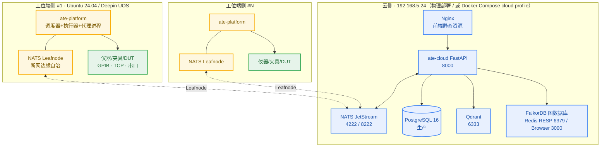

### 10.2 部署模式

| 模式 | 状态 | 说明 |
|------|------|------|
| Docker Compose（dev profile） | ✅ 可用 | 全栈本地开发：nats + qdrant + falkordb + ate-cloud + ate-platform |
| Docker Compose（cloud profile） | ✅ 可用 | 云侧部署：nats + qdrant + falkordb + ate-cloud |
| Podman Compose | ✅ 兼容 | 与 Docker Compose 命令兼容，已在 192.168.5.24 验证 |
| 物理部署（Bare Metal） | ✅ 生产 | 云侧服务器 systemd/nohup 直跑，无容器开销 |
| 虚拟设备仿真 | ✅ 可用 | `ATE_SIMULATION_MODE=true` 或 API 触发 |

### 10.3 资源规划

**最小化生产部署（<10 工位）**：

| 组件 | 资源建议 |
|------|----------|
| NATS Server | 1核 / 1GB |
| PostgreSQL | 2核 / 4GB |
| Qdrant | 2核 / 4GB |
| VictoriaMetrics | 1核 / 2GB |
| Grafana | 1核 / 1GB |
| FastAPI + 调度服务 | 2核 / 4GB |
| **合计** | **约 9核 / 16GB** |

**规模化部署（>50 工位）**：

| 组件 | 部署方式 |
|------|----------|
| NATS Server | 3 节点集群 |
| PostgreSQL | 主从复制 |
| Qdrant | 集群模式 |
| FastAPI | 多实例 + 负载均衡 |

### 10.4 关键环境变量

| 变量 | 默认值 | 说明 |
|------|--------|------|
| `ATE_CLOUD_DATABASE_TYPE` | `sqlite` | sqlite / postgresql / mysql |
| `ATE_CLOUD_NATS_URL` | `nats://localhost:4222` | NATS 连接 |
| `ATE_CLOUD_QDRANT_URL` | `http://localhost:6333` | Qdrant 连接 |
| `ATE_SIMULATION_MODE` | `false` | 启用仿真驱动（Docker dev 默认 true） |
| `ATE_DEV_MODE` | `false` | 调试特性 |
| `FALKORDB_URL` / `FALKORDB_GRAPH` / `FALKORDB_PASSWORD` | `redis://localhost:6379` / `fmea` / _(空)_ | FalkorDB 图数据库连接（Redis RESP，端口 6379；密码留空为无认证） |
| `JWT_SECRET` / `JWT_ALGORITHM` / `JWT_EXPIRE_MINUTES` | — / RS256 / 30 | 认证 |
| `OPENAI_API_KEY` / `OPENAI_BASE_URL` / `OPENAI_MODEL` | — | LLM（OpenAI/DashScope Qwen） |
| `OPENAI_EMBEDDING_MODEL` / `ATE_CLOUD_EMBEDDING_DIMENSIONS` | text-embedding-3-small / 1536 | Embedding |

### 10.5 离线自治（断网继续测试与本地数据缓存）

#### 10.5.1 设计目标

**断网状态下，已下发的序列与脚本必须能在端侧继续执行，全部测试数据缓存本地，网络恢复后自动补传，保证数据零丢失。**

| 目标 | 说明 |
|------|------|
| 断网可运行 | 已下发序列/脚本/工装配置存于端侧本地缓存，断网期间可正常发起与完成测试 |
| 数据零丢失 | 断网期间产生的执行记录、测量值、调用日志、事件全部缓存本地，恢复后按序补传 |
| 状态可感知 | 操作员面板与日志明确显示离线状态、待补传数据量、缓存健康度 |
| 恢复可校验 | 联网恢复后自动对账，确认云端数据与端侧缓存一致 |

#### 10.5.2 端侧缓存分层

| 层 | 存储 | 内容 | 管理策略 |
|----|------|------|----------|
| 序列与工装缓存 | SQLite（WAL） | 已下发序列 YAML（含版本号/校验和）、工装拓扑 JSON | 下发即落库；按产品型号保留最近 N 个版本；校验和不匹配拒绝执行 |
| 脚本缓存 | 本地磁盘 + 元数据入库 | 脚本文件 + 版本 + SHA256 校验和 | 下发时整包同步；执行前校验文件哈希，失败则用上一可用版本并告警 |
| 执行记录缓存 | SQLite 待上传队列 | execution/step 结果、测量值、PASS/FAIL 判定 | 状态机 pending→uploaded→ack；ACK 后保留 7 天再清理 |
| 事件缓存 | NATS JetStream 本地文件存储 | 端→云事件流 | Leafnode 断连期间本地持久化，恢复后补传 |
| 调用录制 | JSONL 文件 | 仪器调用日志 | `/var/log/test_platform/recordings/`，上传成功后归档 |

> **实现备注(2026-08)：** 离线自治模块实际以进程内组件形态落在端侧 `src/ate_platform/offline/`（event_buffer / heartbeat / upload_queue / cache_store / capacity_guard / reconciliation / script_cache / version_lock）。其中 `event_buffer.py`（RH-2）把站内事件写入 JetStream 流 `TESTSTATION_EVENTS`，显式声明 `FileStorage` 并以 durable pull consumer（`AckExplicit` + `DeliverAll`）取回逐条 ACK；服务器侧 `config/nats-server.conf` 将 `store_dir` 固定为 `/var/lib/nats/jetstream`（具名卷挂载），NATS 不可达或进程重启后消息不丢。`publish()` 遵守 fail-soft 契约：NATS 不可达、JetStream 错误、序列化失败一律返回 `False` 并告警，绝不抛异常。云侧对应物是只读模型 `src/ate_cloud/api/v1/offline.py`：`GET /api/v1/offline/status`（离线徽标快照）、`POST /api/v1/offline/reconcile`（手动对账，202）、`GET /api/v1/offline/cache/items` 与 SSE `GET /api/v1/offline/status/stream`，通过构造注入消费端侧组件的公开接口，自身不持有存储。

#### 10.5.3 离线执行流程

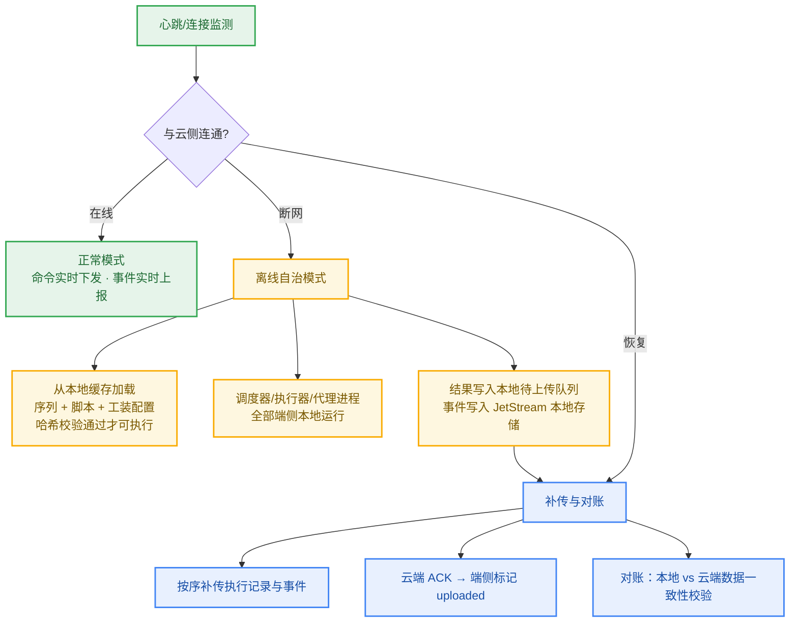

#### 10.5.4 关键机制

1. **下发即缓存**：云→端 `update_plan` / `update_topology` / 脚本下发命令在端侧先落本地缓存并回执 ACK，云端记录下发状态；未完成 ACK 的版本不作为可离线使用版本。
2. **版本一致性**：端侧执行时锁定序列版本与脚本版本快照，断网期间不隐式升级；恢复联网后若云端版本已更新，按“新任务用新版本、进行中任务用锁定版本”处理。
3. **离线授权策略**：离线模式下仅允许执行“已 ACK 确认下发成功”的白名单序列；新序列下发必须联网。
4. **补传顺序与幂等**：补传按时间序进行，云端以 `(station_id, execution_id, seq_no)` 幂等去重，重复补传不产生脏数据。
5. **缓存容量保护**：待上传队列超过阈值（默认 500MB / 72 小时）时告警并暂停接收新序列下发，防止磁盘写满；测量数据不丢弃。
6. **断网感知**：NATS 连接状态监测（心跳超时 10 秒判离线），操作员面板显示离线徽标与待补传计数。

#### 10.5.5 离线能力边界

| 能力 | 离线可用 | 说明 |
|------|----------|------|
| 执行已下发序列 | ✅ | 含夹具控制、多 UUT、仿真模式 |
| 测量数据本地记录 | ✅ | SQLite + 待上传队列 |
| 断点续跑/崩溃恢复 | ✅ | 本地状态快照（6.6 节） |
| 操作员面板本地视图 | ✅ | 端侧本地服务提供 |
| 新序列/脚本下发 | ❌ | 需联网下发并 ACK 后才可离线使用 |
| AI 诊断/脚本生成 | ❌ | 依赖云侧 Qdrant/FalkorDB/LLM |
| SPC/追溯/看板查询 | ❌（部分） | 端侧可查本地记录；全量历史需联网 |
| 跨工位工作流 | ❌ | 依赖云侧编排 |

---

## 11. AI 代码生成指南

> 本章为"方案 → 代码"的转换契约。将本章内容与对应章节交给 AI 编码助手，即可按模块生成符合本方案的代码。

### 11.1 工程约定

| 约定 | 规则 |
|------|------|
| 语言与版本 | Python 3.12+；类型注解全覆盖；async/await 优先 |
| 包管理 | uv；依赖声明在 pyproject.toml |
| 代码质量 | ruff（lint）+ mypy（类型检查）；测试 pytest + pytest-asyncio，覆盖率门槛 80% |
| 前端 | Vue 3.5 + TypeScript + Vite；Pinia 状态；Vitest 测试；vue-tsc 类型检查 |
| 命名 | Python：snake_case；类：PascalCase；TS/前端：camelCase / PascalCase 组件 |
| 日志 | structlog/标准 logging，统一带 execution_id、step_id、uut_id 上下文 |
| 错误处理 | 自定义异常层次：InstrumentError / TimeoutError / ReplayMismatchError / ExecutionAborted / SimulationInitError |
| 配置 | 环境变量 + YAML；机密只走环境变量 |

### 11.2 模块生成清单（按依赖顺序）

AI 生成代码时严格按以下顺序，先底座后上层；每个模块都给出输入契约、输出契约与验收方式：

| 序 | 模块 | 生成依据 | 关键契约 | 验收 |
|----|------|----------|----------|------|
| 1 | `shared/dsl.py` | 6.5 | YAML DSL v3.2 Pydantic 模型 | DSL 示例解析往返一致 |
| 2 | `drivers/base/*` | 6.2.2 / 6.2.4 | 双基类接口（write/ask/方法调用） | 接口一致性测试 |
| 3 | `drivers/mock/*` | 6.2.6 / 6.2.7 / 7.5 | Mock 与真实驱动 API 100% 对齐 | Mock 替换真实驱动跑通示例脚本 |
| 4 | `proxy/instrument_proxy.py` | 6.1.3 | IPC 请求协议（req_id/resource_id/action/args） | 多进程并发请求互斥正确 |
| 5 | `proxy/instrument_client.py` | 6.1.4 | 透明方法转发（__getattr__） | 客户端调用与直连驱动行为一致 |
| 6 | `executor/context_proxy.py` | 6.4.2 | get_instrument/get_var/set_var/measure/log/sleep | 示例脚本（examples/scripts）通过 |
| 7 | `scheduler/compiler.py` | 6.3.4 | loop/branch/subsequence 展开为扁平 DAG | 展开结果与手写等价 DAG 对比 |
| 8 | `scheduler/scanner_scheduler.py` | 6.3.3 / 6.3.5 / 6.3.6 | 事件驱动 + 兜底扫描 + 超时重试 | 单 UUT 完整序列仿真通过 |
| 9 | `scheduler/uut_sync.py` | 6.3.7 | barrier 带超时防死锁 | 4 UUT 并行无死锁 |
| 10 | `scheduler/state_snapshot.py` | 6.6 | save/load/can_resume/cleanup | 模拟崩溃后恢复，仪器被 *RST |
| 11 | `simulation/*` | 7.2–7.10 | DryRunner / FaultInjector / ReplayEngine | 7.11 验收标准 |
| 12 | `fixture/fixture_controller.py` | 6.7.1 | clamp/release/set_route/read_sensor | 仿真夹具动作序列正确 |
| 13 | `scheduler/topology_validator.py` | 6.7.2 | validate() 返回 errors/warnings | 构造非法拓扑被拒绝 |
| 14 | `runtime/topology_state.py` + `fault_localizer.py` | 5.4 / 8.3.7 | NATS 主题与事件格式 | SSE 前端收到事件 |
| 15 | `comm/nats_client.py` | 5.3 | 主题规范 teststation/{station_id}/... | 云边命令/事件往返 |
| 16 | `ate_cloud/api/v1/fixtures.py` | 8.3 + 9.4.1 | CRUD + validate + versions | API 测试 |
| 17 | 前端 SequenceEditor | 8.2 | X6 ↔ YAML 双向转换 | 图→YAML→图无损 |
| 18 | 前端 FixtureDesigner | 8.3 | 数据模型 8.3.2 + 校验 8.3.5 | 8 类校验用例 |

### 11.3 接口契约要点（生成时不可偏离）

1. **IPC 请求协议**（执行进程 → 代理进程）：
   ```json
   {"req_id": "uuid", "resource_id": "PSU_1", "action": "write|ask|method|connect|disconnect",
    "args": [...], "kwargs": {...}}
   ```
   响应：`{"req_id": "...", "result": ..., "elapsed": 0.12}` 或 `{"req_id": "...", "error": "...", "error_type": "..."}`

2. **仪器操作动词**：write / ask / method（kwargs 含 method_name）/ connect / disconnect；驱动层统一提供 identify()、reset()。

3. **resource_id 格式**：SCPI/GPIB 用 PyVISA 资源串（`GPIB0::1::INSTR`）；TCP 用 `TCP::<host>::<port>`。

4. **仿真开关**：唯一入口为 ContextProxy 的 `simulation` 标志与 `ATE_SIMULATION_MODE` 环境变量；脚本层零感知。

5. **NATS 主题**：严格按 5.2 主题树；事件 payload 必含 `execution_id` 与 `timestamp`。

6. **DSL 字段**：以 6.5.2 属性表为准；`on_failure ∈ {abort, continue, skip}`；`uut_affinity ∈ {any, <UUT_ID>}`。

7. **拓扑事件**：SSE event 名与 5.4 TypeScript 联合类型一一对应。

### 11.4 提示词模板（示例）

> 按《ATE Studio 系统方案 V4.0》第 6.1 节实现 `src/ate_platform/proxy/instrument_proxy.py`：
> 单进程 InstrumentProxy，继承 multiprocessing.Process；per-instrument threading.Lock；
> IPC 请求协议见 11.3 第 1 条；调用日志 JSONL 每 100 条刷盘到 /var/log/test_platform/recordings/；
> 仿真模式从 MockDriverFactory 取驱动；预留 _fault_injector.check 拦截点。
> 同时生成 pytest：并发 2 个客户端操作同一仪器验证互斥、操作不同仪器验证并行。

---

## 12. 实施计划

### 12.1 任务分解与工作量（V3.2 评审后修正）

| 项目 | 优先级 | 预估 | 说明 |
|------|--------|------|------|
| 仪器代理进程（连接池/锁/IPC/录制） | 高 | 4人日 | 架构级新增组件 |
| 驱动双基类分离 | 高 | 2人日 | 解决兼容性问题 |
| pymeasure 适配层 | 高 | 2人日 | F1 补全 |
| pyvisa-sim 集成（可选联调工具） | 低 | 0.5人日 | 降级为独立工具 |
| Mock 驱动重构（双基类对齐） | 高 | 3人日 | — |
| 自研补充驱动（Chroma TCP 协议等） | 高 | 3人日 | — |
| ContextProxy + 脚本标准接口 | 高 | 2人日 | — |
| 循环/分支编译器 | 高 | 3人日 | F4 补全 |
| 步骤超时/重试/跳过策略 | 高 | 2人日 | F5 补全 |
| 多 UUT 调度 + 同步屏障 | 高 | 5人日 | F6 补全 |
| 持久化状态快照 + 恢复流程 | 中 | 2人日 | 含仪器重置 |
| 故障注入引擎（四层） | 高 | 4人日 | 完整实现 |
| L4 DryRun 验证器 | 中 | 2人日 | 序列逻辑预验证 |
| 工装拓扑数据模型 + API + DB | 高 | 5人日 | — |
| 夹具控制建模 | 高 | 2人日 | F9 补全 |
| 拓扑→调度联动校验 | 高 | 2人日 | F10 补全 |
| 工装调试器前端（X6 + 共享组件） | 高 | 6人日 | — |
| X6 共享组件层抽取 | 高 | 1人日 | — |
| 接线校验引擎（8类） | 高 | 2人日 | — |
| 运行时 SSE 状态推送（含夹具/DUT） | 高 | 3人日 | — |
| 故障定位器 + 可视化 | 高 | 5人日 | — |
| NATS 云边通信 | 高 | 3人日 | F12 补全 |
| 录制/回放引擎 | 中 | 3人日 | 数据源已就绪 |
| 仿真调试控制台前端 | 中 | 5人日 | — |
| YAML DSL v3.2 更新 | 中 | 1人日 | barrier/fixture_control |
| CI/CD 仿真测试集成 | 低 | 2人日 | — |
| **离线自治**（本地缓存/断网执行/补传对账） | 高 | 4人日 | 10.5 节新增需求 |
| **核心合计** | — | **~78人日** | — |
| 操作员面板与运维（P4） | 中 | 6人日 | 面板前端 + 日志监控 |
| 工装调试器高级功能（P2/P3） | 低 | ~18人日 | 继电器矩阵编辑、Route 管理、自动布局、3D、热力图 |

### 12.2 分阶段里程碑

| 阶段 | 周期 | 内容 | 阶段验收 |
|------|------|------|----------|
| **P0 架构基础** | 3周 / ~15人日 | 代理进程、双基类、适配层、Mock 重构、ContextProxy、自研驱动 | Spike：Keysight 34465A 端到端（真实+Mock） |
| **P1 调度核心** | 3周 / ~15人日 | 编译器、超时重试、多 UUT 同步、快照、故障注入、DryRun | 单 UUT 完整序列仿真运行通过 |
| **P2 工装与联动** | 3周 / ~16人日 | 拓扑模型+API、夹具建模、联动校验、调试器前端、X6 共享层、接线校验 | 工装配置→仿真运行→状态显示端到端 |
| **P3 云边与完善** | 2周 / ~12人日 | NATS、SSE 推送、故障定位、录制回放、仿真控制台、DSL 更新、CI/CD | 云边命令/事件闭环；仿真 CI 接入 |
| **P4 面板与运维** | 1周 / ~6人日 | 操作员面板、日志监控 | 试运行 |

> 总周期约 12 周；核心功能（P0–P2）约 9 周后可投入试运行。

---

## 13. 实现状态基线（2026-08 快照）

> 本章记录代码库当前实现状态，作为增量开发的基线；与代码库同步维护。

### 13.1 已实现（核心引擎）

| 功能 | 代码位置 |
|------|----------|
| 事件驱动扫描式调度引擎 + 兜底扫描 | `src/ate_platform/scheduler/scanner_scheduler.py` |
| ContextProxy 变量空间 + @measure 装饰器 | `src/ate_platform/executor/context_proxy.py` |
| 资源锁管理（本地锁，Redis 预留） | `src/ate_platform/scheduler/` |
| LoopCompiler 语法糖展开 | DSL 编译阶段 |
| 进程隔离执行 | `src/ate_platform/executor/` |
| YAML DSL v3.0 | `src/shared/dsl.py` |
| OpenHTF 适配器 | `src/ate_platform/openhtf/` |

### 13.2 已实现（云侧与前端）

- FastAPI（端口 8000，Swagger /docs）、脚本库管理 API、AI 脚本生成、NATS 云边通信（Core + JetStream）、SSE 事件桥、Git-based 脚本版本、JWT 认证（RS256）
- AntV X6 3.1.7 序列编辑器、节点组件、属性面板、X6↔YAML 序列化、拖拽、循环依赖检测、Monaco 编辑

> **实现备注(2026-08)：** Worker 版本核对端点已实现：`GET /api/v1/workers/{worker_id}/version-check`（`src/ate_cloud/api/v1/workers.py`），响应模型为 `WorkerVersionCheckResponse`（含逐项 `WorkerVersionDiff`，定义于 `src/ate_cloud/schemas/script.py`）。它从 JetStream KV 桶 `ate-scripts` 读取该 worker 上报的脚本版本标签，与脚本仓库当前 Git HEAD 逐一比对；属于只读诊断，不要求 worker 当前在线注册——离线节点的版本滞后正是要检查的内容。NATS 客户端缺失时返回 503，KV 读取失败返回 502。

### 13.3 已实现但路由未挂载（13 个 → 已全部挂载）

原 13 个路由（auth、calibrations、debug、diagnose、faults、limits、operator_checkpoints、products、recordings、spc、trace、workers、workflows）已全部挂载至 `src/ate_cloud/api/v1/router.py`：

- `auth`、`debug`、`workers` 此前已挂载；
- `calibrations`、`diagnose`、`faults`、`limits`、`operator_checkpoints`、`products`、`recordings`、`spc`、`trace`、`workflows` 于 2026-08 完成挂载；
- `limits.py` 已加 `prefix="/limits"`、`products.py` 已加 `prefix="/products"`；
- `operator_checkpoints`、`recordings` 与 `executions` 共享 `/executions` 前缀经核实无真实路由冲突（固定段 events/abort/checkpoint/record/replay/recording/recordings 全部唯一），直接挂载即可。

> 配套：开发库执行 `alembic upgrade head` 应用 `e8f9a0b1c2d3`（trace 字段，含 `dut_serial`）等 6 个迁移，trace/recordings/operator_checkpoints 业务链路方可正常。

### 13.4 超出原设计的增强功能（已实现）

三层仿真系统、MockDriverFactory、AI 故障诊断（Qdrant + FalkorDB FMEA）、SPC、校准管理、可追溯性、多工位工作流、录制/回放、操作员检查点、故障预测、换型优化（CP-SAT）、人力资源分配、自适应跳过、ATML 导出、gRPC 驱动接口、OpenTelemetry 可观测性、NATS Leafnode 边缘自治、Alembic 迁移、CI/CD 流水线。

### 13.5 待完成项

| 项目 | 优先级 | 说明 |
|------|--------|------|
| ~~挂载剩余 13 个 API 路由~~ | 高 | ✅ 已全部挂载（2026-08，见 13.3）；limits/products 已加前缀，executions 前缀无真实冲突 |
| ~~P0 仪器代理进程（连接池/锁/IPC/录制）~~ | 高 | ✅ 已完成（2026-08）：`src/ate_platform/proxy/`（connection_pool / instrument_proxy / instrument_client / proxy_manager）+ ContextProxy.instrument() 桥接 + Mock HAL/MAL 双引用转发 + JSONL 录制；13 项测试通过（inline 线程 + 真实 Process/Windows spawn 双路径） |
| ~~P0 pymeasure 适配层 + 自研补充驱动（F1）~~ | 高 | ✅ 已完成（2026-08）：`pymeasure_wrappers/`（PyMeasureAdapter 组合式 HAL 适配 + PyMeasureAbstraction MAL + 懒加载注册 keysight_34465a/e36312a/rigol_dp800，pymeasure 未装时优雅降级）；`tcp_instrument.py` TCP 基类 + `examples/chroma_eload.py`（§6.2.5 帧协议 HAL + MAL + Mock）；预连接失败降级为懒连接；structlog 日志统一；35 项驱动/代理测试通过 |
| ~~P1 多 UUT 调度 + 同步屏障（F6）~~ | 高 | ✅ 已完成（2026-08）：`scheduler/uut_sync.py`（UUT 状态机 + UUTManager 分配/释放 + SyncBarrier 线程安全同步屏障，Condition 无忙等，超时强制解除并标记未到达 UUT 为 failed，屏障可复用）；9 项测试通过含 4 UUT 并发无死锁（AC-5）；DSL barrier 步骤接线归入 V3.2 DSL 更新项 |
| ~~P1 持久化状态快照 + 崩溃恢复流程~~ | 高 | ✅ 已完成（2026-08）：`scheduler/state_snapshot.py`（§6.6 参考实现：原子写 tmp+os.replace+fsync、损坏容错返回 None、可恢复判定含 step_states、正常完成清理）；`VariableSpace.snapshot()/restore()` 变量持久化；ScannerScheduler 集成（可选 snapshot_dir，start 时恢复步骤状态/变量、状态变更后自动落盘、全部终态才清理快照，RUNNING/PENDING 回退重跑，`instrument_reset_callback` 恢复时对所有仪器发 \*RST）；PlanBootstrapper/JetStreamWorker 接线（ATE_PLATFORM_SNAPSHOT_DIR 环境变量）；14 项测试通过（原子写/损坏容错/变量 round-trip/崩溃后重启恢复+仪器重置/完成清理/中断保留） |
| ~~P1 四层故障注入引擎（F6/F7）~~ | 高 | ✅ 已完成（2026-08）：`simulation/fault_injector.py`（§7.7 四层 FaultInjector：network/protocol/instrument/scheduler；count/probability/time/condition/state 五种触发；once 一次性；FaultInjectionError 异常族映射 11 种故障类型含 timeout/bus_error 兜底；simpleeval 安全表达式 eval 不泄漏；DSL §7.7.2 加载兼容 action/fault 键别名）；InstrumentSimulator query/read 挂接网络/协议/仪器层（delay 延时/丢包返回空/断连抛错/截断帧/scpi 错误码/value_override/out_of_range）；FullChainSimulator fault_config 接线（每模拟器独立注入器）；27 项测试通过（5 触发方式、9 异常映射、端到端挂接、once 容错重试）；另修复 full_chain_simulator._SimDriver 与 test_instrument_simulator 测试桩的 V3.2 签名脱节（真实 pyvisa open_resource 前移），模拟模块 131 项测试全部通过（AC-6） |
| ~~工装拓扑数据模型 + API + DB + 夹具建模 + 联动校验（F9/F10）~~ | 高 | ✅ 已完成（2026-08）：`src/shared/fixture_topology.py`（§8.3.2 全实体映射 + §8.3.5 八类接线校验引擎 TopologyValidator，YAML/JSON round-trip，from 别名）；`src/ate_cloud/models/fixture_topology.py` + Alembic 迁移 a5f6b7c8d9e0（fixture_topologies/fixture_versions/fixture_device_templates）；`src/ate_cloud/api/v1/fixtures.py`（§9.2 CRUD + validate + duplicate + versions + export json/yaml，版本自动递增）；`src/ate_platform/fixture/fixture_controller.py`（§6.7.1 夹具控制：clamp/release/set_route/read_sensor，气缸+位置传感器确认，proxy 转发含 ProxyManager.client 资源分发，模拟模式可跑动作序列）；`src/ate_platform/scheduler/topology_validator.py`（§6.7.2 拓扑→调度联动：仪器存在性/资源接线与 UUT 亲和/并行步骤仪器互斥需矩阵开关/夹具控制能力匹配，error 阻断 warning 提示）；共享拓扑 21 项 + 云侧 fixtures 24 项 + FixtureController 15 项 + 端侧联动 24 项测试通过 |
| ~~步骤超时/重试/跳过策略补全（F5）~~ | 高 | ✅ 已完成（2026-08）：`scheduler/step_registry.py` 新增 `StepExecutionConfig`（frozen dataclass：max_retries/retry_delay_ms/repeat_on_measurement_fail/repeat_limit/force_repeat/skip_if）+ StepRegistry 配置存储与 retry/repeat 计数器（register(config=...)/get_config/get/increment/reset_retry_count/get/increment/reset_repeat_count，unregister/clear 全量清理）；`scheduler/scanner_scheduler.py` 新增 `handle_step_result(step_id, status)` 决策矩阵（ERROR→重试置回 PENDING、FAILED→重复、force_repeat 无视 limit、PASSED→清零计数、耗尽置回 ERROR/FAILED）+ `pause()/resume()`（asyncio.Event 阻塞新派发、幂等、is_paused）+ `force_next()`（一次性绕过 skip_if）+ `_dispatch_step` 集成 pause 阻塞/force_next 消耗/config.skip_if 求值（Phase 3）+ `get_status` 增 paused/force_next_pending 字段；per-step timeout 由 loop_executor/process_executor 既有 step.timeout 支持；41 项测试通过（默认全禁用向后兼容、max_retries=2→3 次后停止、重复上限、组合 retry+repeat、skip 三种配置路径、暂停阻塞/恢复、force_next 一次性） |
| ~~运行时 SSE 状态推送（夹具/DUT）+ 故障定位器（后端）~~ | 高 | ✅ 已完成（2026-08）：`runtime/topology_state.py`（TopologyRuntimeState：instrument/link/relay/measurement/fixture/fault 状态更新 + on_change 变更回调 + 快照首次下发，18 项测试）；`runtime/fault_localizer.py`（FaultLocalizer：测量越界→开路/短路/超量程、仪器 fault 透传 severity、继电器状态异常、夹具传感器未到位/超温，has_clues 兜底门控，severity 排序，15 项测试）；`nats/sse_bridge.py` 新增独立 "topology" 流队列（get_stream_queue/publish_stream_event/remove_stream_queue，与 /events 主队列隔离、引用计数、满队丢最旧）；`api/v1/executions.py` 新增 `GET /executions/{run_id}/topology-stream`（§8.3.6 事件类型 instrument/link/relay/measurement/fixture/fault，15s keep-alive，断开清理）；云侧 6 项测试通过；前端拓扑可视化归入工装调试器前端项 |
| ~~工装调试器前端 + 仿真调试控制台前端~~ | 高 | ✅ 已完成（2026-08）：`frontend/src/api/fixtures.ts`（§9.2 工装拓扑全量 API 封装：CRUD/validate/duplicate/versions/export/device templates + 全部实体类型）；`frontend/src/stores/topologyRuntime.ts`（§8.3.6 Pinia store：订阅 topology-stream SSE 的 instrument/link/relay/measurement/fixture/fault 事件，12 项测试，FakeEventSource 无原生 EventSource 的 jsdom 环境）；`frontend/src/views/FixtureDesigner.vue`（§8.3 工装设计调试器：X6 画布三列布局 仪器/工装/DUT、端口连线带 linkId/signalType、运行时状态着色 fault 红/active 动画/idle 半透明、故障定位 suspect_links 高亮、设备库拖拽、校验/版本/复制/导出、加载执行并连接 LIVE）；`frontend/src/views/SimulationConsole.vue`（仿真调试控制台：tier/noise 配置、故障注入规则 CRUD、断点 CRUD、调用日志表格按 decision/measurement 过滤、仿真报告）；`src/ate_cloud/schemas/execution.py` 新增 SimulationRequest/SimulationResultEvent/SimulationResponse；`src/ate_cloud/api/v1/executions.py` 新增 `POST /executions/{run_id}/simulate`（materialize → DryRunScheduler/FullChainSimulator 复用端侧仿真模块，noise/fault_config 接线）；`frontend/src/api/debug.ts`（Debug 断点 CRUD）；router 新增 /flow/fixture-designer 与 /monitor/simulation 路由 + DB 菜单 seed（工装设计调试器/仿真调试控制台）；云侧仿真 API 5 项测试通过；前端 tsc 0 错误 + vitest 318 通过 + vite build 成功 |
| ~~YAML DSL v3.2 更新（barrier/fixture_control）+ CI 仿真测试集成~~ | 高 | ✅ 已完成（2026-08）：`src/shared/dsl.py` StepType 扩展为 v3.2 八类（script/action/loop/branch/barrier/fixture_control/call/subsequence，小写值匹配 YAML `type` 字段）；YamlStep 新增 `type/depends_on/uut_affinity/on_failure/barrier_name/action/fixture_id` 字段，`on_failure` 与 `on_fail` 别名归一（v3.2 优先）；YamlLoop 新增 `depends_on`；`src/ate_platform/dsl/parser.py` 按 `type` 分派容器（loop→YamlLoop 推断 FOR/WHILE/FOREACH、branch/subsequence→BRANCH/SUBSEQUENCE 步骤带 then/else/steps 参数）、resources list 归一为 dict（§6.5.2 list[string] 兼容 v3.0 dict，消费方零改动）、validate 补充 barrier 须 barrier_name / fixture_control 须 action+fixture_id；frontend DSL 类型重新生成（scripts/generate_dsl_types.py）+ 3 处 script 可空兜底修复；新增 `src/ate_platform/simulation/headless_runner.py`（AC-12 无头仿真：`python -m ate_platform.simulation.headless_runner plan.yaml --tier dry_run|full [--junit out.xml] [--fault-config rules.yaml]`，自包含 JUnit XML 生成，PASS→通过 / SKIP·BLOCKED→skipped / FAIL·ERROR·NOT_REACHED→failure，退出码基于 all_passed 含循环依赖死锁）；`tests/fixtures/plan_v32_production.yaml`（§6.5.4 完整生产序列：fixture_control+barrier+loop×5，14 步骤全链路通过）；`.github/workflows/ci.yml` 新增 headless-sim job（ATE_SIMULATION_MODE=true 跑 headless+DSL 测试 junitxml + v3.2 序列 full/dry_run 双 tier + JUnit artifact 上传）；新增测试 16 项通过（test_dsl_v32.py 15 项 + test_headless_simulation.py 8 项，含 v3.2 全步骤类型解析/校验/round-trip、resources 归一、JUnit 结构、故障配置加载）；DSL/仿真/序列化/集成 101 项测试通过、mypy/ruff 通过（AC-12 达成） |
| F1–F7 验证检查项 | 中 | flexible-production-optimization 计划最终验证 |
| 预存测试-实现脱节清理 | 中 | tests/cloud 现有 71 个预存失败（auth 401 未生效、execution 控制端点 404、SSEBridge 缺 `push_to_queue_only`、`AsyncClient.app`、NATS publish mock、traceback analyzer、WorkerVersionCheckResponse 未实现等），与路由挂载无关 |
| 生产环境 PostgreSQL 迁移 | 中 | 当前默认 SQLite，生产建议切换 |
| 前端构建产物部署 | 中 | 当前仅 dev 模式，需 nginx 静态资源部署 |
| 真实硬件测试验证 | 低 | 当前仅虚拟设备仿真，真实 PyVISA 驱动未经产线验证 |
| V3.2 新增项 | 高 | 仪器代理进程、双基类、编译器等同步落地（见 12.1） |

---

## 14. 风险与应对

| 风险 | 等级 | 应对 |
|------|------|------|
| 仪器代理进程成为性能瓶颈 | 中 | per-instrument 锁 + 线程池并发处理不同仪器；单仪器操作串行是物理约束 |
| pymeasure 多重继承适配风险 | 中 | P0 先 Spike 验证 1 个仪表；不行则改用组合模式（内部持有 pymeasure 实例） |
| IPC 通信开销 | 低 | 单次约 0.1–0.5ms，相对 ms 级仪器操作可忽略 |
| 状态快照恢复后仪器状态不一致 | 中 | 恢复流程强制 *RST 所有仪器后重建状态 |
| Chroma TCP 协议开发量超预期 | 中 | 先评估协议文档，必要时仅实现序列用到的命令子集 |
| 拓扑调度联动校验误报 | 低 | 校验分 error（阻断）/warning（提示），严格度可配置 |
| 多 UUT 同步屏障死锁 | 中 | 屏障带超时，超时强制解除并标记未到达 UUT 为 failed |
| 依赖关系复杂导致可视化混乱 | 中 | 依赖分析视图、自动分层布局、条件折叠 |
| 事件丢失或顺序错乱 | 低 | 兜底全量扫描 + 事件持久化日志 |

---

## 15. 验收标准

| 编号 | 验收项 | 标准 |
|------|--------|------|
| AC-1 | 架构闭环 | A1–A3 三个架构级问题的解决方案落地并通过并发测试（附录 A） |
| AC-2 | 调度能力 | 串行/并行/分支/循环/屏障/子序列全部可表达；超时重试跳过策略生效 |
| AC-3 | 零硬件运行 | `ATE_SIMULATION_MODE=true` 下完整电源产测序列端到端通过 |
| AC-4 | 仪器覆盖 | DMM/PSU/ELoad/GPIB/TCP 五类虚拟仪器可用，Mock 与真实驱动 API 100% 兼容 |
| AC-5 | 多 UUT | 4 UUT 同时仿真，互斥正确无死锁，屏障超时兜底有效 |
| AC-6 | 故障注入 | ≥8 种故障类型，count/probability/time/state 四类触发均可用 |
| AC-7 | 录制回放 | 真实执行录制可回放，测量值偏差 <1%（容差内） |
| AC-8 | 工装校验 | 8 类接线校验全部覆盖，非法拓扑阻断执行 |
| AC-9 | 运行时可视化 | 活跃链路/仪器/继电器/测量值实时高亮，延迟 <500ms |
| AC-10 | 故障定位 | 失败步骤可在拓扑上高亮定位并给出修复建议 |
| AC-11 | 崩溃恢复 | 杀进程后重启可从快照恢复，仪器被重置，已完成步骤不重跑 |
| AC-12 | CI 集成 | 无头仿真输出 JUnit 报告并接入流水线 |
| AC-13 | 离线自治 | 断网状态下已下发序列/脚本可继续完整执行；执行数据全部缓存本地；恢复联网后自动补传，云端与端侧对账一致、零丢失 |

---

## 附录 A：评审问题闭环跟踪表

### A.1 架构级问题

| 编号 | 问题 | 原状态 | 解决方案 | 落地章节 |
|------|------|--------|----------|----------|
| A1 | GPIB 仿真双路径冲突 | pyvisa-sim 与 MockInstrumentBase 职责不清 | pyvisa-sim 降级为协议联调工具，主仿真路径统一走 Mock | 6.3 / 7.2 |
| A2 | 多进程资源锁失效 | threading.Lock 无法跨进程 | 仪器代理进程 InstrumentProxy 集中所有仪器操作 | 6.1 |
| A3 | TCP 设备基类不兼容 | 强行继承 pymeasure.Instrument | 双基类分离（SCPI 继承 pymeasure，TCP 独立） | 6.2 |

### A.2 功能缺口

| 编号 | 缺口 | 补全章节 |
|------|------|----------|
| F1 | pymeasure 驱动适配 | 6.2.3 |
| F2 | 仪器连接池/会话管理 | 6.1.5 |
| F4 | 循环/分支编译器 | 6.3.4 |
| F5 | 步骤超时/重试/跳过 | 6.3.6 |
| F6 | 多 UUT 同步 | 6.3.7 |
| F7 | L3 脚本仿真拦截 | 6.4 / 7.4 |
| F9 | 夹具控制建模 | 6.7.1 |
| F10 | 拓扑与调度联动 | 6.7.2 |
| F12 | NATS 云边通信 | 第 5 章 |

### A.3 工作量修正记录

| 项目 | V3.1 预估 | V3.2 预估 | 变化原因 |
|------|-----------|-----------|----------|
| pymeasure 集成+基类+适配层 | 2人日 | 4人日 | 双基类分离与适配层 |
| 仪器代理进程（连接池/锁） | 0 | 4人日 | 新增架构级组件 |
| 自研补充驱动 | 2人日 | 3人日 | Chroma 协议复杂 |
| 循环/分支编译器 | 含在调度中 | 3人日 | 独立设计 |
| 多 UUT 调度+同步 | 4人日 | 5人日 | 同步屏障 |
| 故障注入引擎 | 3人日 | 4人日 | 四层完整实现 |
| 夹具建模+拓扑联动 | 含在工装中 | 2人日 | 独立补充 |
| **合计** | **~24人日** | **~34人日** | **+10人日（架构级补全）** |

---

## 附录 B：参考资料

- pymeasure 官方文档（Python 仪器控制库）
- PyVISA / pyvisa-sim 文档
- OpenHTF 项目（Google，Apache 2.0）— Plug 机制与 Phase 设计
- AntV X6 3.x 官方文档与迁移指南
- NATS / NATS JetStream 官方文档
- IEEE 1671 ATML 标准
- 项目内部文档：实现方案.md（V3.0）、电子产品产测上位机软件平台开发方案V3.2.md、虚拟仿真调试功能补充方案.md、可视化工装设计调试器设计方案.md

---

## 附录 C：电源产品典型测试序列示例

```yaml
# sequences/power_supply_full_test.yaml
# 场景：12V/5A 电源完整产测（仿真 Profile：power_supply_normal）
# 验证点：上电时序、空载电压、负载调整率、纹波、OCP 触发点、效率
name: "12V/5A电源完整产测"
version: "3.2"
fixture_id: "fixture_ps_12v5a_v1"
uut_count: 2
steps:
  - id: fixture_clamp
    type: fixture_control
    action: clamp
  - id: power_on
    script: lib_power/power_on.py
    resources: ["PSU_1", "ELoad_1"]
    depends_on: [fixture_clamp]
  - id: load_regulation
    type: loop
    count: 5
    iterator: load_step
    depends_on: [power_on]
    steps:
      - id: set_load
        script: lib_power/set_load.py
        params: { current: "${load_step * 1.0}" }
      - id: measure_vout
        script: lib_power/measure_vout.py
        timeout: 10
        retry: 2
        on_failure: continue
  - id: ocp_trigger
    script: lib_power/ocp_test.py
    depends_on: [load_regulation]
  - id: fixture_release
    type: fixture_control
    action: release
    depends_on: [ocp_trigger]
```

---

## 附录 D：模块自治性确认

| 模块 | 自治性 | 关键接口 | 依赖 |
|------|--------|----------|------|
| 仪器代理进程 | ✅ 独立进程 | IPC request/response Queue | 驱动层 |
| SCPI 驱动层 | ✅ | PlatformSCPIInstrument 接口 | pymeasure, PyVISA |
| TCP 驱动层 | ✅ | PlatformTCPInstrument 接口 | socket |
| Mock 驱动层 | ✅ | 与真实驱动同接口 | 无外部依赖 |
| 调度引擎 | ✅ | 步骤 DAG + ContextProxy | 代理进程客户端 |
| ContextProxy | ✅ | get_instrument/get_var/measure | 代理进程客户端 |
| 仿真系统 | ✅ | simulation 标志切换 | Mock 驱动 + 故障注入器 |
| 工装拓扑 | ✅ | JSON 拓扑数据 | X6 前端 + 后端 API |
| 夹具控制器 | ✅ | clamp/release/set_route/read_sensor | 代理进程 |
| NATS 通信 | ✅ | publish/subscribe/request | NATS Server |
| 前端工装调试器 | ✅ | X6 图编辑 + SSE 状态 | 后端 API |

**所有模块均可独立开发、测试、部署，模块间通过明确定义的接口交互，无循环依赖。**

---

*文档版本：V4.1（综合评审版）| 日期：2026-08-17*
*整合来源：开发方案 V3.2 + 虚拟仿真补充方案 v1.0 + 工装调试器设计 v1.0 + 实现方案实现状态 + 项目 README*
*核心架构：仪器代理进程、驱动双基类、事件驱动扫描式调度、四层虚拟仿真、工装拓扑联动*
*总工作量：核心约 78 人日（含离线自治 4 人日）+ 扩展约 24 人日 | 总周期：约 12 周*
